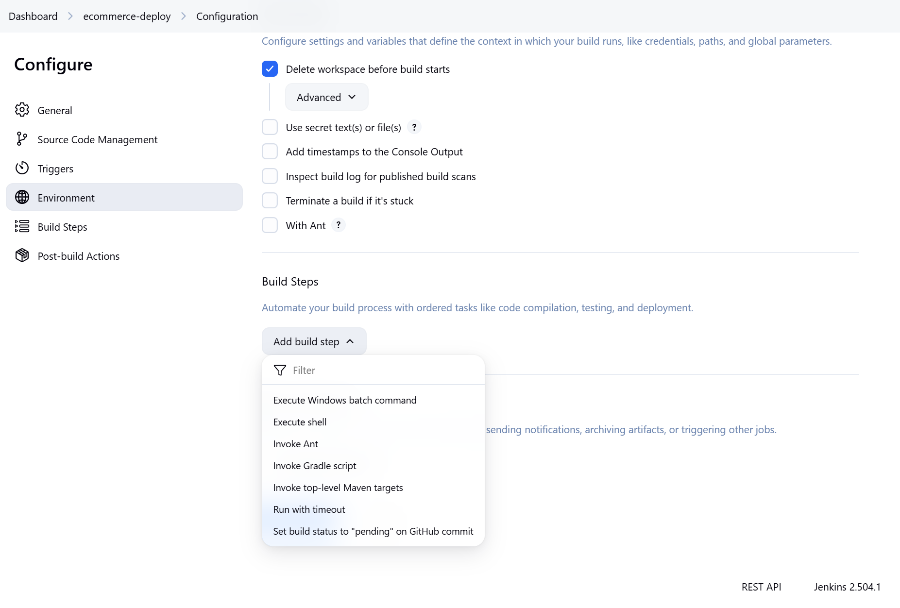
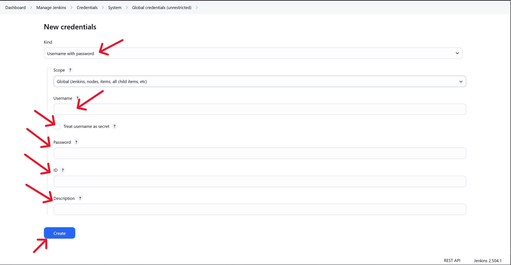

# **AUTOMATING DEPLOYMENT OF AN E-COMMERCE WEBSITE**

## **Objective**

The objective of this project is to design and implement a robust CI/CD pipeline using Jenkins to automate the deployment of a web application.
We will be automating the deployment pipeline of an e-commerce web application using:

- Jenkins (automation server for CI/CD)
- Docker (to containerize the applicaction)
- EC2 (to host our Jenkins and application deployment environment)

What this means is that once we push our source code to GitHub or once a developer pushes codes to GitHub, Jenkins should automatically do the following:

1. Pull the source code (pull the latest code from GitHub)
2. Run tests (if any)
3. Build a Docker image
4. Push that image to Docker Hub
5. Deploy the container on an EC2 server
6. Make the web app accessible via browser

## **Tools and Stack**

The tools and stack we will be using for this project include the following:

| Tools             | Purpose                                     |
| ----------------- | ------------------------------------------- |
| GitHub            | For Source Code Management                  |
| Jenkins           | For CI/CD Pipeline Automation               |
| Docker            | For Containerization of Application         |
| Docker Hub        | For Remote Image Registry                   |
| AWS EC2 (Ubuntu)  | To create Server for Jenkins & Deployment   |
| Node.js App       | The Sample E-commerce Application           |
| Nginix (Optional) | To act as our Reverse Proxy / Load Balancer |


## **1. Jenkins Server setup**

Here, we will configure Jenkins for CI/CD pipeline automation by doing the following:
- Launch an Ec2 instance
- Install Java, Jenkins, Git and Docker
- Configure Jenkins to access Docker.

### **Launch the EC2 instance**

We launch the EC2 instance upon which we will install our Jenkins server, Java, Git and Docker by do the following steps below:

1. Go the AWS console
2. Navigate to the EC2 Dashboard
3. Click "**Launch Instance**".
4. Set instance configurations and click on "launch instance"


### **Set inbound rules**

Set inbound rules for the instance to allow traffic on TCP ports 80 and 8080 in addition to the already opened port 22.


**NOTE:** It is important to set port 8080 because Jenkins runs on port 8080 by default.


### **Connect to the EC2 Instance**

To connect to the instance, do the following:


### **Install Java**

We need to install Java onto our instance because Jenkins requires Java. We do this by running the following commands below:

```
sudo apt update
sudo apt install default-jdk-headless
java --version
```


### **Install Jenkins**

To install Jenkins, the following steps have to be taken:

#### **1. Add the Jenkins key securely to the keyring:** <br>

Here, we will add Jenkins key securely to a dedicated keyring using the command below.

```
curl -fsSL https://pkg.jenkins.io/debian/jenkins.io-2023.key | sudo tee \
  /usr/share/keyrings/jenkins-keyring.asc > /dev/null
```


The command above securely adds the Jenkins GPG key to our system's trusted keyring, which is used to verify the authenticity of Jenkins packages when installing from their repository. <br><br>


#### **2. Add the Jenkins LTS repository using the signed keyring**

```
echo deb [signed-by=/usr/share/keyrings/jenkins-keyring.asc] \
  https://pkg.jenkins.io/debian-stable binary/ | sudo tee \
  /etc/apt/sources.list.d/jenkins.list > /dev/null
```


The command above adds the Jenkins LTS (Long-Term Support) APT repository to our system, and it specifies that the repository should be verified using the previously added GPG key.
<br> <br>

#### **3. Install the Jenkins**

We need the update the package lists and install Jenkins using the commands below:

    sudo apt update
    sudo apt install -y jenkins


#### **4. Start and enable Jenkins**
    sudo systemctl enable jenkins
    sudo systemctl start jenkins


#### **5. Check Jenkins status**
    
    sudo systemctl status jenkins


    
#### **6. Open Jenkins in Browser**

Now, we can open our installed Jenkins server on the browser of our choice, by going to: `http://<your-ec2-public-ip>:8080`.
In this case, it is `http://18.234.111.38:8080.
Remember that Jenkins runs on port 8080.


**Unlocking Jenkins:**

- **Enter URL with ip address of Jenkins EC2 instance:**
Once we have entered our URL with the ip address of the EC2 instance which we launched to host the Jenkins, we will see the setup screen for the Jenkins server which requires us to unlock it.


- **Retrieve Jenkins initial admin password:**
To unlock Jenkins, we need to retrieve the initial admin password from the directory below.
   
    `/var/lib/jenkins/secrets/initialAdminPassword`

    In our terminal, while connected to the Jenkins EC2 instance, we run the following command to display the password Jenkins generated for the initial setup, so that we can retrieve it and use it to unlock Jenkins:

        sudo cat /var/lib/jenkins/secrets/initialAdminPassword

    You will get a password as the output. Copy the password from the terminal and paste it into the input field, then click continue.

    


#### **7. Install suggested plugins and create admin user**

Once Jenkins loads, you need to do the following:

- Click Install Suggested Plugins
- Set up an admin user (Username + Password).

**Note:** This step is important and you should not skip it, because Jenkins needs an admin user for credentials and job management.


### **Install Git and Docker**

Next, we will install Git and Docker by running the following command:

    sudo apt install -y git docker.io


**Check the versions installed:**

Once you are done installing git and docker, you need to confirm your installations by checking the versions, using the commands below:

    git --version
    docker --version


#### **8. Give Jenkins permission to use Docker**

This part is very important as failure to do so will result in Jenkins having difficulty to run or use docker. <br>
By default, Jenkins runs as the user `jenkins`, but that user is not in the `docker` group. Therefore, it is vital that we add the `jenkins` user to the `docker` group by doing the following:

```
sudo usermod -aG docker jenkins
sudo systemctl restart jenkins
```


**Confirm the permissions:**

Confirm the permissions have been given using the commands below:

```
sudo su - jenkins
docker ps
```


#### **9. Apply Security Measures**

Security is very important in IT and software development activities, amd as DevOps engineers, security is very important to be considered. Let's lock things properly by checking the steps below for the ones we haven't executed and implement them:

**1. Create your Admin User after plugin installation.** We already executed this aspect in the beginning while installing Jenkins, as we finished installing suggested plugins.

**2. Enable Matrix-based security:** This is one of the authorization strategies available for securing Jenkins as it allows us to grant specific permissions to users and groups. To enable matrix-based security, we do the following:

- Go to Manage Jenkins → Configure Global Security.
- Under Authorization, select Matrix-based security.
- Set permissions carefully:
- Admin user: full control
- Anonymous: no permissions


## **2. Source Code Management Repository Integration**

Now, we will connect Jenkins to a Git-based version control system (GitHub), which is the place where our code lives. It is the version control system for our source code management. To do this, we will have to do the following:


### **A.** **Integrating Jenkins with GitHub** <br>

We can integrate Jenkins with GitHub by doing the following steps below:

-  **Step 1:** Install Git and Git Plugin (if not already installed)

    To do this, we go on to our EC2 instance which serves as our Jenkins host and run the following commands:

    ```
    sudo apt install git -y
    ```
    In our case, we already installed git earlier, so no need to re-install it again. We can verify our git installation by running the command below:

    ```
    git --version
    ```

    


    Next, we go to our Jenkins server and do the following below:

    - On the Jenkins Dashboard, go to `Manage Jenkins` and then head to `Manage Plugins`.
    - Under Installed, verify that Git plugin is present.
    - If not, go to the Available tab, search for Git plugin, install, and restart Jenkins.

    In our case, git is already installed.

    


- **Step 2: Create a GitHub Repository**

    - We will go to GitHub [https://github.com.]
    - Create a new repository and name it `ecommerce-website`.
    - Create README.md file to initialize the repository and add description to the file.
    - Next, we add `gitignore` since we are using `Node.js`, although adding gitignore file is optional. Then, we choose `Node` from the dropdown when adding `gitignore` file. 
    - From here, we can go to our local pc and clone the repository down to our computer and begin developing and pushing our codes.

    

    


- **Step 3: Create freestyle job and configure Source Code Management:**

    Next, we will head over to the Jenkins server/platform and do the following:

    - Create a freestyle job named `ecommerce-deploy`.
    - Click on the job.
    - Click on `Configure`
    - Navigate to "Source Code Management" section.
    - Select `Git`.
    - Under `Repository URL` section, type in the repository URL of your project on GitHub as shown below:

            https://github.com/Oladeji-Okuns/ecommerce-website.git
    
    - In the `Branches to build` section, ensure it is set to `*/main`.

    

<br>

### **B. Configuring Webhooks for automatic triggering of Jeekins Builds**

To do this:

- Navigate to the same `ecommerce-deploy` freestyle job.
- Click on `Configure`.
- Scroll to the `Trigger` section.
- Select `GitHub hook trigger for GITScm polling.


    
- **Set up Personal Access Token (PAT):**

    Before Jenkins can connect to GitHub, you need to set up personal access token so that Jenkins can use the PAT to authenticate and GIT will be able to connect successfully.

    - **Create a Personal Access Token (PAT)**
    
        - Go to GitHub: https://github.com/settings/tokens
        - Click "Generate new token" (or "Fine-grained token")
        - Set the following:
        - Name: In this case, we use "Jenkins Git Access"
        - Expiration: Choose a time period or “No expiration”
        - Permissions: You can choose either of below, based on your needs.
            - For classic tokens: enable repo
            - For fine-grained tokens: give access to the correct repo and read-only or read/write as needed
            - Finally, click `Generate token`
            - Copy the token — you won’t be able to see it again!

    - **Add GitHub Credentials to Jenkins**
        
        In Jenkins, go to `Manage Jenkins`, then from there, go to `Credentials`. Choose your domain, (in our case it is `global`) and click on `Add Credentials`.

        On the Credentials page opened, select the following:
        - Kind: Username with password
        - Username: input your GitHub username
        - Password: paste the personal access token (not your GitHub password)
        - Optionally we can set an ID and description. In our case, we are only setting the ID as `github-pat`.
        - Then, click to Save.

        

        


## **3: Create a Jenkins Freestyle Project:**

To do this, we do the following steps:

- **Step 1: Create the new freestyle project:**

    - Open Jenkins at http://<your-ec2-public-ip>:8080.
    - Click "New Item".
    - Enter project name: ecommerce-deploy.
    - Choose Freestyle project, then click OK.

    

    
<br>

- **Step 2: Configure the source code management:**

    Inside our freestyle project titled `ecommerce-deploy` project, we do the following:
    
    - Put a description in the description box.
    - Scroll to Source Code Management section.
    - Select Git.
    - In Repository URL section, we paste our GitHub repo link for our project. https://github.com/Oladeji-Okuns/ecommerce-website.git

    - Credentials: we select the credentials we created and saved earlier. (This includes our GitHub username + PAT).<br> 
    `Note:` 
        - If the repo is public, no credentials needed. <br>
        - If private: Click on `Add` → Jenkins → Add your GitHub username and Personal Access Token (PAT).

        Here, you need to create a PAT on github, incase you haven't done so (with repo and admin:repo_hook scopes). Then return to paste the token details and username in Jenkins.
        
    - In `Branches to build`: Ensure we select the main branch `*/main`.

    


- **Step 3: Setting Up GitHub Webhook to Trigger Jenkins Build**

    - Navigate to the repository's settings (settings for ecommerce-website repository).
    - Click on `Webhooks` on the left side of the settings page.
    - Copy the Jenkins server's EC2 instance's public ip address and paste into `Payload URL` section, in the format below:

            http://98.80.6.122:8080/github-webhook/

    - Then select or choose `application/json` in the `Content type` section.
    - Save

    `NOTE:`

    It is important to ensure that our EC2 App is accessible and we get that done by doing the following:

    - Allow inbound HTTP (port 80) or HTTPS (port 443) in our EC2 Security Group.
    - Make sure our app is running on port 80 or 443, or configure Nginx/Apache to reverse proxy to it.


- **Step 4: Configure Build Environment:**

    - On the `Configure` page, scroll to `Build`
    - Tick "Delete workspace before build starts" (to ensure clean builds).

    


- **Step 5: Configure Build Steps:**

    - **i. Install Dependencies**

        To do this, do the following:

        - Click  "Add build step"
        - Select "Execute shell"
        - Paste the commands/script below into the execute shell command box

            ```bash
            echo "Installing dependencies..."
            npm install
            ```

        
        
        `NOTE:` You can also include `npm run build` as part of the commands for the execute shell.


        <br>

    - **2. Run Unit Tests:**

        To do this, we do the following:

        - Click  "Add build step"
        - Select "Execute shell"
        - Paste the commands/script below into the execute shell command box

            ```bash
            echo "Running unit tests..."
            npm run test
            ```

            

        - Then save.

        

        <br>

## **4. Jenkins Pipeline for Web Application**

To create the Jenkins pipeline for the `ecommerce-website`, we will do the following:

- **Step 1: Create the `Jenkinsfile` in the `ecommerce-website` repository.**

        cd ecommerce-website
        touch Jenkinsfile


- **Step 2: Create a declarative pipeline script for the project.**

    Next, we will create our pipeline script and paste it in a `Jenkinsfile` which we created in the `ecommerce-website` respository.

    - **1. Create Jenkinsfile:**

            cd ecommerce-website
            vi Jenkinsfile

    - **2. Write the script into the Jenkinsfile:**

        A sample Jenkins pipeline script for the ecommerce-website has been written using Declarative Syntax, and pasted in the `Jenkinsfile`.

        ```groovy

        pipeline {
            agent any
            stages {
                stage('Install Nginx') {
                    steps {
                        script {
                            // Update package index and install Nginx
                            sh '''
                                sudo apt update
                                sudo apt install -y nginx
                            '''
                        }
                    }
                }
                stage('Clone Repository') {
                    steps {
                        // Clone your GitHub repository
                        git url: 'https://github.com/Oladeji-Okuns/ecommerce-website.git', branch: 'main'
                    }
                }
                stage('Deploy') {
                    steps {
                        // Copy index.html to the Nginx web server directory
                        sh '''
                            sudo cp index.html /var/www/html/
                            sudo systemctl restart nginx
                        '''
                    }
                }
                stage('Health Check') {
                    steps {
                        script {
                            // Perform a health check to ensure Nginx is serving the page
                            def response = sh(script: 'curl -s -o /dev/null -w "%{http_code}" http://localhost', returnStdout: true).trim()
                            if (response != '200') {
                                error("Health check failed with response code: ${response}")
                            }
                        }
                    }
                }
            }
        }

        ```

        `NOTE 1:` In order for Jenkins to be able to run sudo priviledged commands as stated in the script above, you need to set permissions for Jenkins, by doing the following:
            
        - Log into the EC2 instance
        - Use the `visudo` command to safely open and edit the `sudoers` file, which is usually found in the `etc/sudoers`

                sudo visudo

        - Add the Jenkins permission: Once in the `visudo` editor, scroll to the bottom of the file and add the following line:

                jenkins ALL=(ALL) NOPASSWD: ALL

            This line allows the Jenkins user to run any command with sudo without being prompted for a password.
        
        - Save and Exit.
            - If you're using nano as the editor (which is common), save the changes by pressing CTRL + X, then Y to confirm, and Enter to exit.
            - If you're using vi, press Esc, type :wq, and press Enter to save and exit.

            <br>

        `NOTE 2:` In a case where you have a Node.js application instead, you can use a pipeline script like the one below:     <br> <br>   

        ```groovy

        pipeline {
            agent any

            environment {
                // Define environment variables (optional)
                NODE_HOME = '/usr/local/bin/node'
                PATH = "${NODE_HOME}:$PATH"
            }

            stages {
                // Checkout stage: Get the latest code from the repository
                stage('Checkout') {
                    steps {
                        git 'https://github.com/Oladeji-Okuns/ecommerce-website.git'  // Your GitHub/Bitbucket repository URL
                    }
                }

                // Build stage: Install dependencies and build the application
                stage('Build') {
                    steps {
                        script {
                            // For a Node.js application
                            sh 'npm install'
                            sh 'npm run build'
                        }
                    }
                }

                // Test stage: Run unit tests for the application
                stage('Test') {
                    steps {
                        script {
                            // For Node.js application using Jest (or any other testing framework)
                            sh 'npm run test'
                        }
                    }
                }

                // Deploy stage: Deploy the application (can be to any server or platform)
                stage('Deploy') {
                    steps {
                        script {
                            // Example of deploying to a server (could be a Docker container, EC2, etc.)
                            // Modify this depending on your deployment method
                            sh 'npm run deploy'  // Ensure you have a deploy script or steps
                        }
                    }
                }
            }

            post {
                success {
                    echo 'Pipeline executed successfully!'
                }
                failure {
                    echo 'Pipeline failed!'
                }
            }
        }

        ```


        **Analysis of Pipeline Stages:**

        - **First Pipeline Script:** 
            This is just a simple pipeline script that does the following based on the different stages as shown below:
        
            - **1. Install Nginx:** Installs Nginx on the EC2 instance.
            - **2. Clone Repository:** Clones your GitHub repository containing the index.html file.
            - **3. Deploy:** Copies the index.html file to the Nginx web server directory and restarts Nginx to serve the new content.
            - **4. Health Check:** Checks that Nginx is running and serving the page correctly.

        <br>

        - **Second Pipeline Script**
            - **1. Checkout:** This step checks out the latest code from your GitHub (or Bitbucket) repository using the git command.

             - **2. Build:** This stage installs the necessary dependencies (npm install) and then builds the application (npm run build).

            - **3. Test:** After the build, it runs unit tests (npm run test) using your chosen testing framework (e.g., Jest, Mocha).

            - **4. Deploy:** This stage deploys the application. Depending on your setup, you could use a custom deployment script or deploy it to a cloud platform (like AWS EC2, Docker, etc.).

            - **5. Post Actions:** This section handles what happens after the pipeline runs:

                - If the pipeline is successful, it will print `"Pipeline executed successfully!"`.

                - If the pipeline fails, it will print `"Pipeline failed!"`.


<br>

- **Step 3: Configure Jenkins to Execute the Jenkinsfile**

    Now that we have our pipeline script developed and ready, we will go ahead to configure our Jenkins to be able to execute our Jenkinsfile by doing the following actions below.

    1. **Create New pipeline Job:**
        
        - Log into Jenkins and on the Jenkins dashboard, click on `New Item`.
        - Select `Pipeline` and give it a name, in our case it is `ecommerce-app-pipeline`.
        - Click OK.

        

    2. **Configure the Pipeline:**

        - Under Pipeline configuration, choose Pipeline script from SCM.
        - Select Git and provide the Repository URL (the same repository where our Jenkinsfile is stored).

            https://github.com/Oladeji-Okuns/ecommerce-website.git

        - Set the Branch to the main branch (e.g., main or master).
        - Click Save.
        - Jenkins will now fetch the Jenkinsfile from the repository and execute it.

        

        


<br>

- **Step 4: Push to GitHub and Test deployment**

    Now that we have been able to configure our pipeline, we can then push our files on our local PC to github, in order to test and see if our pipeline works and the app is built and deployed automatically.

    
    
<br>
<br>


## **5. Docker Image Creation and Registry Push**

Here, we are going to automate the process of building docker images for our web application, running the docker container locally for testing and pushing the built image to a docker registry, which is the Docker Hub.

- **Step 1: Configure Jenkins to Build Docker Images:**

    To begin, we need to ensure that Jenkins can build Docker images as part of the pipeline. We do this by doing the following actions or steps:

    - **1. Install Docker on Jenkins Agent:**

        To ensure that Docker is installed and accessible on the Jenkins agent where the builds will run, we can verify Docker installation by running the following command below:

            docker --version

         


         If Docker is not yet installed, then we can go ahead to run the following commands below to install Docker and to check or verify our installation:

        ```bash

        # Update package index
        sudo apt update

        # Install required packages
        sudo apt install apt-transport-https ca-certificates curl software-properties-common

        # Add Docker GPG key
        curl -fsSL https://download.docker.com/linux/ubuntu/gpg | sudo apt-key add -

        # Set up Docker stable repository
        sudo add-apt-repository "deb [arch=amd64] https://download.docker.com/linux/ubuntu $(lsb_release -cs) stable"

        # Update package index again
        sudo apt update

        # Install Docker
        sudo apt install docker-ce

        # Verify installation
        docker --version

        # Start and enable Docker
        sudo systemctl start docker
        sudo systemctl enable docker

        # Add Jenkins user to Docker group. Gives Jenkins permission to use Docker
        sudo usermod -aG docker jenkins

        # Restart Jenkins
        sudo systemctl restart jenkins

        ```

        We also need to install `Docker-Compose` onto our Jenkins server, so we will do that by running the following commands below:

        ```bash

        # Install Docker Compose using APT
        sudo apt update
        sudo apt install docker-compose

        # Verify the installation
        docker-compose --version

        # Add Jenkins user to the Docker group
        sudo usermod -aG docker jenkins

        # Restart Jenkins
        sudo systemctl restart jenkins

        ```

        Then, we can reboot the server by running the command below:

            sudo reboot


    - **2. Install Docker Plugin for Jenkins:**

        Next, we will have to install the docker plugins for Jenkins by doing the following steps below:

        - On the Jenkins dashboard, we will navigate or go to **Manage Jenkins** ➔ **Manage Plugins** ➔ **Available tab**.
        - Then, we will search for the Docker plugin and install it. This plugin allows Jenkins to interact with Docker and trigger Docker builds.

        

        

    - **3a. Create Docker Hub account on DOcker Hub and set Credentials in Jenkins:**

        We can create a new account on Docker Hub by doing the following:

        - Go to `hub.docker.com`
        - Create an account
        - Click on Repositories > Create Repository
        - Name it: `your-username`/`ecommerce-frontend`
        - Repeat the same action above for ecommerce-backend to give `your-username`/`ecommerce-backend`
        
    
        <br>

        **Then we will set/create the Docker Hub Credentials in Jenkins by doing the following:**

        - Go to Jenkins > Manage Jenkins > Credentials
        - Add a Username + Password credential:
            - Username: your Docker Hub username
            - Password: your Docker Hub password or access token
            - ID: docker-hub-credentials (we'll use this in the Jenkinsfile)


    <br>
    
        
    - **3b. Create/Update Jenkins Pipeline:**
    
        In our `Jenkinsfile`, we will add steps for Docker image building as shown below:

        ```groovy

        pipeline {
            agent any

            environment {
                // Define environment variables for Docker
                DOCKER_IMAGE = 'myusername/ecommerce-web-app'
                DOCKER_TAG = 'latest'
            }

            stages {
                // Checkout code
                stage('Checkout') {
                    steps {
                        git branch: 'main', url: 'https://github.com/username/repository.git'
                    }
                }

                // Build stage: Build the application
                stage('Build') {
                    steps {
                        script {
                            sh 'npm install'
                            sh 'npm run build'
                        }
                    }
                }

                // Docker build stage: Build Docker image
                stage('Build Docker Image') {
                    steps {
                        script {
                            sh '''
                            docker build -t ${DOCKER_IMAGE}:${DOCKER_TAG} .
                            '''
                        }
                    }
                }

                // Run Tests stage (optional, can run inside Docker)
                stage('Test') {
                    steps {
                        script {
                            sh 'npm run test'
                        }
                    }
                }

                // Deploy the web app stage (running container locally)
                stage('Run Docker Container Locally') {
                    steps {
                        script {
                            sh '''
                            docker run -d -p 8080:8080 ${DOCKER_IMAGE}:${DOCKER_TAG}
                            '''
                        }
                    }
                }

                // Push Docker image to registry
                stage('Push Docker Image to Registry') {
                    steps {
                        script {
                            // Login to Docker Hub
                            withCredentials([usernamePassword(credentialsId: 'dockerhub-credentials', usernameVariable: 'DOCKER_USER', passwordVariable: 'DOCKER_PASSWORD')]) {
                                sh 'echo $DOCKER_PASSWORD | docker login -u $DOCKER_USER --password-stdin'
                            }
                            // Push the image to Docker Hub
                            sh "docker push ${DOCKER_IMAGE}:${DOCKER_TAG}"
                        }
                    }
                }
            }

            post {
                success {
                    echo 'Pipeline executed successfully!'
                }
                failure {
                    echo 'Pipeline failed!'
                }
            }
        }

        ```

        **Analysis of the Docker Steps in our Jenkinsfile above:**

        - **1. Build Docker Image:** 
            - In the Build Docker Image stage, we use the docker build command to create an image from the Dockerfile in the repository.

            - The `-t` flag tags the image with a name and tag (e.g., `myusername/ecommerce-web-app:latest`).

        - **2. Run Docker Container Locally:**
            - The docker run command runs the container locally.

            - It maps the application’s port inside the container (8080) to port 8080 on our machine, so we can access the web application in a browser.

        - **3. Push Docker Image to Registry:**
            - First, Jenkins logs in to Docker Hub using the DockerHub credentials stored in Jenkins' Credentials Manager.

            - Then, the docker push command uploads the image to Docker Hub, where it can be pulled by other systems or platforms for deployment.

<br>

- **Step 3: Create Dockerfiles for both Frontend and Backend of the application:**

    In the `frontend/Dockerfile`:

    ```dockerfile

    # Stage 1: Build
    FROM node:18-alpine AS builder

    WORKDIR /app

    # Fix for npm SSL issues
    RUN apk add --no-cache openssl libc6-compat

    # Copy only the necessary files for npm install
    COPY frontend/package*.json ./
    RUN npm install

    # Copy the source files
    COPY frontend/src ./src
    COPY frontend/src/index.html ./index.html
    COPY frontend/vite.config.js ./

    # Build the application
    RUN npm run build

    # Stage 2: Serve with Nginx
    FROM nginx:alpine

    # Copy the built files from the builder stage
    COPY --from=builder /app/dist /usr/share/nginx/html

    # Copy the Nginx configuration
    COPY nginx/nginx.conf /etc/nginx/conf.d/default.conf

    EXPOSE 80
    CMD ["nginx", "-g", "daemon off;"]

    ```

    In the `backend/Dockerfile`:

    ```dockerfile

    FROM node:18-alpine
    WORKDIR /app
    COPY package.json .
    RUN npm install
    COPY . .
    EXPOSE 5000
    CMD ["node", "index.js"]

    ```


- **Step 2: Run the Docker Container Locally:**

    Once the Docker image is built, Jenkins will automatically run the Docker container locally in the Run Docker Container Locally stage. This will allow us to do the following:

    - Confirm that the container is running as expected.
    - Test the application in the Docker container.
    - Access the web application via the following URL: http://localhost:8080
    

            http://localhost:8080
        

<br>

- **Step 3: Push the Docker Image to a Container Registry:**

    This stage requires us to push our docker image that gets created to a container registry like Docker Hub, and to implement this, we need to do the following:

    - **Create a Docker Hub Account:** This is an important step since we haven't done it yet, so we will create an account on Docker Hub (https://hub.docker.com/).


    - **Create the Docker Hub repository:**
        - In this case we created two docker hub repositories for the images that will be built and named them `ecomm-frontend` and `ecomm-backend`.

        
    
    - **Create/Add Docker Hub Credentials in Jenkins:** 
        - In Jenkins, we will go to Manage Jenkins ➔ Manage Credentials ➔ (global) ➔ Add Credentials.
    
        - Select Username with password, and add your Docker Hub username and password.

        

        

        


    - **Login to Docker Hub in the Jenkins Pipeline:**
        - The withCredentials block in the pipeline logs Jenkins into Docker Hub with the stored credentials.

        - After login, Jenkins can push the Docker image to Docker Hub using the docker push command.

        The command to push the docker image to docker hub is:

            docker push username/docker-repo:tagname


    - **Test the Automation:**

        Now, we push our work to github to test and see if our automation of the deployment of the ecommerce erbsite actually works.
        
         


