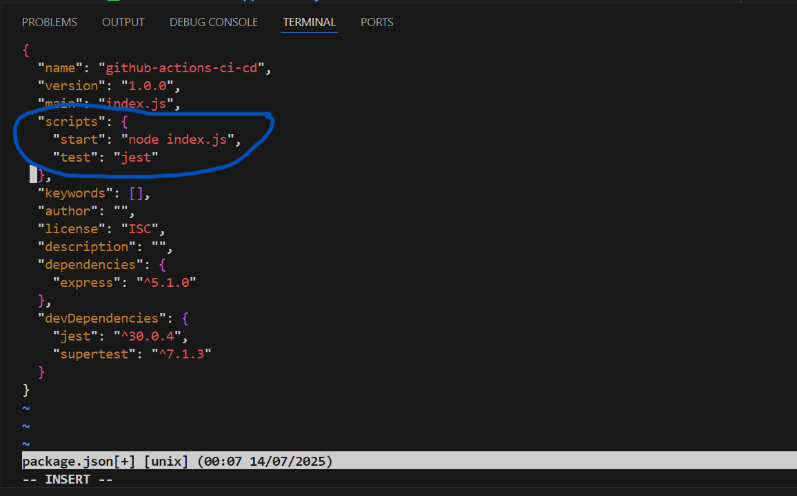
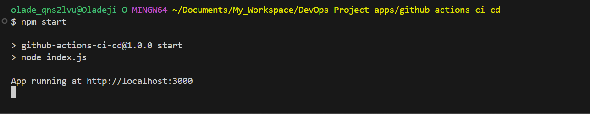

**Project Title:** GitHub Actions and CI/CD Course Project - YAML Focus

---

### Course Objective:

To learn the YAML syntax and structure used in GitHub Actions workflows while implementing Continuous Integration (CI) using Node.js and GitHub Actions.

---

## Course Context

CI/CD is the orchestration of software delivery. YAML is the baton, GitHub Actions the instruments, and you the conductor. This course focuses on YAML mastery for writing effective GitHub workflows.

---

## Pre-requisites Checklist

| Requirement       | Tool/Link                                                                     | How to Verify                       |
| ----------------- | ----------------------------------------------------------------------------- | ----------------------------------- |
| GitHub Account    | [github.com](https://github.com)                                              | Sign up/login                       |
| Git Installed     | [Install Git](https://git-scm.com/downloads)                                  | `git --version`                     |
| Node.js & npm     | [Node.js](https://nodejs.org)                                                 | `node -v` and `npm -v`              |
| JavaScript Basics | [MDN JS Guide](https://developer.mozilla.org/en-US/docs/Web/JavaScript/Guide) | Console/IDE practice                |
| CLI (Terminal)    | Native on macOS/Linux, Git Bash on Windows                                    | Can run terminal commands           |
| Text Editor       | [VS Code](https://code.visualstudio.com/)                                     | Create & edit `.js` or `.yml` files |
| YAML Syntax       | [YAML in Y Minutes](https://learnxinyminutes.com/docs/yaml/)                  | Practice formatting YAML            |

---

## YAML Workflow Syntax & Structure

### Objectives

* To understand the YAML structure in GitHub workflows.
* Master workflow components.

### ■ YAML Basics

```yaml
name: Example Workflow
on: [push]
```

* **Indentation matters**
* Uses `key: value` pairs
* Lists with `- item`

### ■ Key Workflow Components

```yaml
name: Node CI
on: [push]

jobs:
  build:
    runs-on: ubuntu-latest
    steps:
      - uses: actions/checkout@v2
      - name: Install
        run: npm install
      - name: Build
        run: npm run build
      - name: Test
        run: npm test
```

* **Workflow File**: `.github/workflows/main.yml`
* **Job**: A set of steps (e.g. build, test)
* **Step**: Each task (e.g. `npm install`)
* **Action**: Reusable logic block (`actions/checkout@v2`)
* **Runner**: Server (e.g. `ubuntu-latest`)
* **Event**: What triggers the workflow (e.g. `push`, `pull_request`)

---

## Implementing CI in GitHub Actions

### Lesson 1: Building & Testing with GitHub Actions

### Objectives:

* Build project via GitHub workflow.
* Automatically test every push.

### Step-by-step YAML:

```yaml
name: Node.js CI/CD
on: [push]

jobs:
  build:
    runs-on: ubuntu-latest
    steps:
      - uses: actions/checkout@v2
      - name: Install dependencies
        run: npm install
      - name: Build app
        run: npm run build
      - name: Run tests
        run: npm test
```

### Notes:

* `actions/checkout@v2` checks out repo code
* `npm install`: installs dependencies
* `npm run build`: builds the app
* `npm test`: runs test suite

---

## Additional YAML Concepts

### Objectives

* To master environment variables and secrets
* Use conditional logic
* Share data between steps

### 1. **Using Environment Variables**

Environment variables can be defined at the workflow, job, or step level. They allow you to dynamically pass configuration and settings.

```yaml
env:
  NODE_ENV: production

jobs:
  example:
    runs-on: ubuntu-latest
    steps:
      - name: Print ENV
        run: echo $NODE_ENV
```

### 2. **Working with Secrets**

Secrets are encrypted variables set in your GitHub repository settings. Ideal for storing sensitive data like access tokens, passwords, etc.

```yaml
jobs:
  deploy:
    runs-on: ubuntu-latest
    steps:
      - name: Use secret
        run: echo "Token: ${{ secrets.ACCESS_TOKEN }}"
```

### 3. **Conditional Jobs/ Conditional Execution**

You can control when jobs, steps, or workflows run based on conditions.

```yaml
jobs:
  conditional:
    runs-on: ubuntu-latest
    if: github.ref == 'refs/heads/main'
    steps:
      - run: echo "Running on main branch"
```

### 4. **Using Outputs Between Steps**

You can also share data between steps in a job using outputs as shown below.

```yaml
jobs:
  pass-data:
    runs-on: ubuntu-latest
    steps:
      - id: first-step
        run: echo "::set-output name=message::Hello YAML"
      - run: echo "Message: ${{ steps.first-step.outputs.message }}"
```

---

## Lesson 2: Build Matrices & Parallel Jobs

### Objectives:

* Test against multiple Node.js versions

### Example:

```yaml
jobs:
  test-matrix:
    runs-on: ubuntu-latest
    strategy:
      matrix:
        node: [14, 16, 18]
    steps:
      - uses: actions/checkout@v2
      - name: Setup Node
        uses: actions/setup-node@v2
        with:
          node-version: ${{ matrix.node }}
      - run: npm install
      - run: npm test
```

---


## Practical Implementation of GitHub CICD using YAML as learnt above

Now, after learning the use of YAML in GitHub CICD, we will begin a practical implementation that will showcase the application of GitHub CICD using YAML.


### CI/CD Workflow Automation with GitHub Actions & YAML
---

We will implement this in a stepwise manner as shown below starting by planning our project app and setting up the environment to be used for it, creating our GitHub Yaml workflow, before then implementing other advanced yaml tasks. <br>


## **STEP 1: Environment Setup + App Initialization**

### 1.1 Install Required Tools

At this stage, we need to make sure the following tools below are installed on our system:

| Tool              | How to Check            | If Not Installed                                  |
| ----------------- | ----------------------- | ------------------------------------------------- |
| **Node.js** + npm | `node -v` and `npm -v`  | [Install Node.js](https://nodejs.org/en/download) |
| **Git**           | `git --version`         | [Install Git](https://git-scm.com/downloads)      |
| **Text Editor**   | Open VS Code or similar | [Install VS Code](https://code.visualstudio.com/) |


---

### 1.2 Create Project Folder

> This is our working directory on our computer.

We do this by running the commands below on our local computer

```bash
mkdir github-actions-ci-cd
cd github-actions-ci-cd
```


---

### 1.3 Initialize a Node.js App

Next, we will initialize a Node.js app by running the following command below.

```bash
npm init -y
```


This creates a `package.json` file and the content of the file is shown below.


---

### 1.4 Install Express.js

We will then install **Express.js**.

```bash
npm install express
```


---

### 1.5 Create the App Code

Next, we will create our project app code which will be for use, by doing the following.

> Create a file named: `index.js`
> Paste the following **Express.js** code:

```bash
touch index.js
vi index.js
```

Then paste the following code below into the file, and save it.

```js
// index.js
const express = require('express');
const app = express();
const port = process.env.PORT || 3000;

app.get('/', (req, res) => {
  res.send('&#128512; Hello from your GitHub Actions CI/CD App!');
});

app.listen(port, () => {
  console.log(`App running at http://localhost:${port}`);
});
```


---

### 1.6 Add a Sample Test

We can add a sample test for now. We will use Jest to test the app later.

```bash
npm install --save-dev jest supertest
```

Now add a sample test file:

```bash
mkdir tests
touch tests/app.test.js
```


After doing this, open the file and paste this content below into the `tests/app.test.js`:

```js
const request = require('supertest');
const express = require('express');

const app = express();
app.get('/', (req, res) => res.send('&#128512; Hello from your GitHub Actions CI/CD App!'));

describe('GET /', () => {
  it('should return greeting message', async () => {
    const res = await request(app).get('/');
    expect(res.text).toBe('&#128512; Hello from your GitHub Actions CI/CD App!');
  });
});
```


Next, we will update the `package.json` test script as given below:

```json
"scripts": {
  "start": "node index.js",
  "test": "jest"
}
```

To do this, we will run the following commands and actions:

```bash
vi package.json
```

Then, we will update the scripts section as shown below:



---

### 1.7 Test the App Locally

With this, we can now test our app locally, given that we have already created our test file and update the package.json file with the test script. <br>
To test our app locally, we do the following:


```bash
npm start
```

When we open our browser and visit the URL:
 `http://localhost:3000`,we should see: `😀 Hello from your GitHub Actions CI/CD App!`



On browser:


<br>

**To test, we can run the following command below:**

```bash
npm test
```


---


### 1.8 Push to GitHub

Now let’s initialize Git and push to GitHub.

1. **Create a new repo** on [GitHub](https://github.com/new)
   (Name it: `github-actions-ci-cd-project`)

   

   **Note:** You will need to create a `.gitignore` file, and this is recommended to avoid pushing unnecessary files to your github repo.

   You can create a simple `.gitignore` by doing the following:

    ```bash
    touch .gitignore
    vi .gitignore
    ```

   Then paste the following below into the file:

    ```bash
   # .gitignore
    node_modules/
    .env
    dist/
    build/
    *.log
    ```

2. Then in terminal, run:

    ```bash
    git init
    git remote add origin https://github.com/YOUR_USERNAME/github-actions-ci-cd-project.git 
    git add .
    git commit -m "Initial commit with Node.js app"
    git branch -M main
    git push -u origin main
    ```

    

    

    


---

With all these that we have done above, we have successfully done the following:

* Built a Node.js app
* Added a basic test
* Pushed it to GitHub

So now, we are ready for CI/CD!

---


## **STEP 2: Implementing the GitHub Actions CI Workflow (`main.yml`)**

This is where we begin using **YAML** to automate the **CI** part of our project. This means that we will run build and test steps **automatically** every time we push code to GitHub.


For this to be possible, we will have to carry out the following actions:

- Create `.github/workflows/` folder
- Create `main.yml` workflow file
- Add CI steps: checkout, install, build, test
- Push to GitHub and see GitHub Actions in real-time


---

### 2.1 Create GitHub Actions Folder and File

Inside your project folder, run:

```bash
mkdir -p .github/workflows
touch .github/workflows/main.yml
```


---

### 2.2 Write the CI Workflow in `main.yml`

You can now paste this full YAML content below into `.github/workflows/main.yml`:

```yaml
name: Node.js CI

# When the workflow should run
on:
  push:
    branches: [ main ]
  pull_request:
    branches: [ main ]

# What the workflow does
jobs:
  build:
    runs-on: ubuntu-latest

    strategy:
      matrix:
        node-version: [14.x, 16.x, 18.x]  # Test on multiple versions

    steps:
      - name: Checkout Code
        uses: actions/checkout@v2

      - name: Set up Node.js ${{ matrix.node-version }}
        uses: actions/setup-node@v2
        with:
          node-version: ${{ matrix.node-version }}

      - name: Install Dependencies
        run: npm install

      - name: Build Project
        run: npm run build --if-present

      - name: Run Tests
        run: npm test
```

**NOTE:** In this workflow, you can see that we have already made provision for the matrix starategy in order to test on multiple versions like the version 14.x, 16.x and 18.x.

---

### Breakdown/Analysis of the YAML File

| Key                   | Meaning                                         |
| --------------------- | ----------------------------------------------- |
| `name`                | Workflow name                                   |
| `on`                  | Triggers: push & pull\_request to `main` branch |
| `jobs.build`          | Main job                                        |
| `runs-on`             | Runner OS (GitHub’s Ubuntu VM)                  |
| `matrix.node-version` | Run the job 3x with Node v14, v16, v18          |
| `steps`               | Actual CI tasks                                 |
| `checkout`            | Clone repo                                      |
| `setup-node`          | Set up correct Node version                     |
| `npm install`         | Install dependencies                            |
| `npm run build`       | Build app (if applicable)                       |
| `npm test`            | Run tests                                       |

---

### 2.3 Push the Workflow to GitHub

Since, we have been able to create our CI workflow file and pasted the code content into the file, then we can commit and push our workflow to GitHub.

```bash
git add .github/workflows/main.yml
git commit -m "Add CI workflow using GitHub Actions"
git push
```


---

### 2.4 View the Workflow in Action

Now, we will go to our GitHub repo page and do the following in order to view the workflow which we just created in action:

1. Click the **“Actions”** tab

    

2. We should see a new workflow triggered by our latest push

    

3. It will show **three jobs** — one for each Node version

    

4. Expand each job to see logs for checkout, install, build, test

    

    

    

From the 3 outputs or results above, we can see that the build process/jobs was successful for Node 18.x version but it failed in Node versions 14.x and 16.x.

## **Reasons for Node failures:**

### **Node.js 14.x** — **Fails Because of:**

#### **1. `npm install` warning messages (**Incompatible `package-lock.json`**):** <br>

These are not fatal, just warnings, but they reveal what's wrong. The errors are:

  * Our lock file uses `lockfileVersion: 3` (npm v7+).
  * Node 14 uses `npm v6`, which only supports `lockfileVersion: 1`.

    ```
    npm WARN read-shrinkwrap This version of npm is compatible with lockfileVersion@1, but package-lock.json was generated for lockfileVersion@3.
    ```
    
    This error above, means that:
    
    - Our package-lock.json was generated with npm v7+, but Node.js 14 uses npm v6, which doesn't fully understand lockfile v3.
    - Secondly, it tries its best, but behavior may be unreliable.
    
    **How to fix this issue:**
    To fix this issue, we can use npm install with a matching version of Node/npm OR regenerate the lockfile with an older npm (npm i --legacy-peer-deps), but generally, this is not the biggest issue.

<br>

#### 2. **Unsupported engine for several dependencies**

As given in a sample from the Node's errors, which is shown below, we will notice that there is unsupported engine for several dependencies as given below:

```
npm WARN notsup Unsupported engine for express@5.1.0: wanted: {"node":">= 18"} (current: {"node":"14.21.3","npm":"6.14.18"})
```

* Packages like `express@5.1.0`, `send@1.2.0`, `body-parser@2.2.0`, and `jest-leak-detector@30.0.2` **require Node >= 18**.
* Node 14 cannot run these versions.

#### 3. **Jest Uses `os.availableParallelism()`**

* The `os.availableParallelism()` is a Node **v18+ API** but it is not available in Node 14.
* Since it is not available in Node 14, it thefore causes a `TypeError`.

<br>

**Result:** Jest crashes + engine mismatches = **build fails**

---

### **Node.js 16.x** — **Fails for Similar Reasons:**

#### 1. **Same Unsupported Dependencies**

* Just like Node 14, these packages **won’t run** on Node 16 either.

#### 2. **Same Jest Crash**

* Node 16 also lacks `os.availableParallelism()` → Jest throws `TypeError`.

#### 3. **Lockfile Warning**

* Node 16 may use npm 7, which **understands lockfile v3**, but **not enough to fix the other fatal errors**.

**Result:** Incompatible dependencies + Jest API usage = **build fails**

---

### **Node.js 18.x** — **Build Succeeds Because:**

* It supports `os.availableParallelism()`
* It is fully compatible with all our dependencies
* It uses npm 8+, compatible with `package-lock.json v3`

---


### Recommendation

To resolve these issues above and to avoid errors from popping up anymore, we can do the following recommendation below:

- **Update Workflow to Only Test Node 18/ Use only Node 18+ across board:**

  We can simply update our GitHub Actions workflow to **only use Node.js 18+** as shown below:

  ```yaml
  strategy:
    matrix:
      node-version: [18.x]
  ```

  **Note:** Since most packages now require Node 18+ anyway, upgrading our project base to Node 18 is the best long-term solution.

- **Downgrade to Compatible Packages for Node 14 and Node 16:**

  If we must support Node 14.x for example, we will need to change our dependencies by running the command below:

  ```bash
  npm install express@4 jest@29
  ```

  And then, we will regenerate our package-lock.json as below:

  ```bash
  rm package-lock.json
  npm install
  ```

### **Resolution:**

- Resolve Error by using only Node 18.x version:**

  

- Push to github and check actions again:


---

## **STEP 3: Advanced GitHub Actions YAML Features**

Now that our CI is running successfully, it is time for us to make it smarter and more secure by using some advanced GitHub Actions Yaml features like Environment Variables, Secrets, Conditionals and Outputs.

**Importance of these advanced features:**
1. **Environment Variables:** enable us to reuse config and values without hardcoding them.
2. **Secrets:** securely store sensitive data (e,g., tokens).
3. **Conditionals:** control when jobs or steps run.
4. **Output:** These share data betweem steps.

<br>

1. **Using Environment Variables:** Here, we can define a custom variable `APP_NAME` and use it in a step to print a message. 

        NOTE: You can choose to name your custom variable anything you want, for example, you can call it `CUSTOM_VAR`, but in this case I choose to use `APP_NAME` as our custom variable.

      To implement this, we can modify our `main.yml` to look like this below, where by we add or define the env under the build step in jobs script.

    ```yaml
    name: Node.js CI

    # When the workflow should run
    on:
      push:
        branches: [ main ]
      pull_request:
        branches: [ main ]

    # What the workflow does
    jobs:
      build:
        runs-on: ubuntu-latest

    # The env variable defined here
        env:
          APP_NAME: github-actions-ci-cd-app

        strategy:
          matrix:
            node-version: [18.x]

        steps:
          - name: Checkout Code
            uses: actions/checkout@v2

          - name: Set up Node.js ${{ matrix.node-version }}
            uses: actions/setup-node@v2
            with:
              node-version: ${{ matrix.node-version }}

          - name: Install Dependencies
            run: npm install

          - name: Build Project
            run: npm run build --if-present

          - name: Run Tests
            run: npm test

          - name: Echo App Name from ENV
            run: echo "Deploying $APP_NAME"
    ```

    

    **NOTE:** The `env:` applies to all steps in the job.

<br>

2. **Using GitHub Secrets:** To implement this we will create a fake secret key in GitHub and use it securely in our workflow, by doing the following steps:

- First, we go to our GitHub repository.
- Click on `Settings`, then click on `Secrets and variables`, then finally click `Actions`.
- Click New repository secret

  - **Name**: MY_TEST_SECRET_TOKEN
  - **Value**: this_is_fake_for_demo_purposes


  

  

- Next, we add this Step below to our `main.yml` file/script:

  ```yaml
        - name: 🔐 Use GitHub Secret
          run: echo "The secret is ${{ secrets.MY_SECRET_TOKEN }}"
  ```
  
  Therefore, our updated `main.yml` file will now look like this below:

  ```yaml
  name: Node.js CI

  # When the workflow should run
  on:
    push:
      branches: [ main ]
    pull_request:
      branches: [ main ]

  # What the workflow does
  jobs:
    build:
      runs-on: ubuntu-latest

      # The env variable defined here
      env:
        APP_NAME: github-actions-ci-cd-app

      strategy:
        matrix:
          node-version: [18.x]

      steps:
        - name: Checkout Code
          uses: actions/checkout@v2

        - name: Set up Node.js ${{ matrix.node-version }}
          uses: actions/setup-node@v2
          with:
            node-version: ${{ matrix.node-version }}

        - name: Install Dependencies
          run: npm install

        - name: Build Project
          run: npm run build --if-present

        - name: Run Tests
          run: npm test

        - name: Echo App Name from ENV
          run: echo "Deploying $APP_NAME"

        - name: 🔐 Use GitHub Secret
          run: echo "The secret is ${{ secrets.MY_SECRET_TOKEN }}"
  ```

  

  **`NOTE:`** To avoid this secret printing in public logs (It is not recommended for real tokens), you should only echo secrets for testing purposes.

<br>

3. **Using advanced feature `Conditional Execution (if)`:**

    With `Conditional Execution`, we can control when jobs, steps, or workflows run based on conditions.
    Here, we will run a step only on push events, not pull requests. To do this, we will simply add the following step below to our `main.yml` script/file.

    ```yaml
          - name: Only run on push to main
            if: github.event_name == 'push' && github.ref == 'refs/heads/main'
            run: echo "This is only running on a push to the main branch!"
    ```

    **`NOTE:`** The conditional step should come after checkout (since it uses GitHub context), but before build/test — because it controls behavior specific to a push to main.

    Our updated `main.yml` file will now look like this below:

    ```yaml
    name: Node.js CI

    # When the workflow should run
    on:
      push:
        branches: [ main ]
      pull_request:
        branches: [ main ]

    jobs:
      build:
        runs-on: ubuntu-latest

        # The env variable defined here
        env:
          APP_NAME: github-actions-ci-cd-app

        strategy:
          matrix:
            node-version: [18.x]

        steps:
          - name: Checkout Code
            uses: actions/checkout@v2

          - name: Only run on push to main 
            if: github.event_name == 'push' && github.ref == 'refs/heads/main'
            run: echo "This is only running on a push to the main branch!"

          - name: Set up Node.js ${{ matrix.node-version }}
            uses: actions/setup-node@v2
            with:
              node-version: ${{ matrix.node-version }}

          - name: Install Dependencies
            run: npm install

          - name: Build Project
            run: npm run build --if-present

          - name: Run Tests
            run: npm test

          - name: Echo App Name from ENV
            run: echo "Deploying $APP_NAME"

          - name: 🔐 Use GitHub Secret
            run: echo "The secret is ${{ secrets.MY_SECRET_TOKEN }}"
    ```

4. **Using advanced feature `Outputs` for Passing Outputs Between Steps:**

    With this feature, we can share data between steps in a job using outputs.
    We can get this done by adding the following step below to our `main.yml` file:

    ```yaml
          - id: generate
            run: echo "::set-output name=commit_message::$(git log -1 --pretty=%B)"

          - name: Print Commit Message
            run: echo "Last commit message was: ${{ steps.generate.outputs.commit_message }}"
    ```

    **`NOTE:`** Due to errors encountered after pushing to github, I have made some corrections to the codes above. Below are the corrections to the script codes above:

    ```yaml
    - name: Generate Commit Message
            id: generate
            run: echo "commit_message=$(git log -1 --pretty=%B)" >> "$GITHUB_ENV"

          - name: Print Commit Message
            run: echo "Last commit message was: $commit_message"
    ```

    These first step is meant to capture the last Git commit message using git log, while the second step is to print that commit message using the `set-output` mechanism.

    **`NOTE:`** These two steps should be placed after checking out the code (actions/checkout@v2), because git log needs access to the actual repo commit history.
    So, they should come right after the `Checkout Code` step and before any Node or build steps. 

    Our updated `main.yml` file will now look like this instead:

    ```yaml
    name: Node.js CI

    on:
      push:
        branches: [ main ]
      pull_request:
        branches: [ main ]

    jobs:
      build:
        runs-on: ubuntu-latest

        env:
          APP_NAME: github-actions-ci-cd-app

        strategy:
          matrix:
            node-version: [18.x]

        steps:
          - name: Checkout Code
            uses: actions/checkout@v2

          - name: Only run on push to main
            if: github.event_name == 'push' && github.ref == 'refs/heads/main'
            run: echo "This is only running on a push to the main branch!"

          - name: Generate Commit Message
            id: generate
            run: echo "commit_message=$(git log -1 --pretty=%B)" >> "$GITHUB_ENV"

          - name: Print Commit Message
            run: echo "Last commit message was: $commit_message"

          - name: Set up Node.js
            uses: actions/setup-node@v2
            with:
              node-version: ${{ matrix.node-version }}

          - name: Install Dependencies
            run: npm install

          - name: Build Project
            run: npm run build --if-present

          - name: Run Tests
            run: npm test

          - name: Echo App Name from ENV
            run: echo "Deploying $APP_NAME"

          - name: Use GitHub Secret
            run: echo "The secret is ${{ secrets.MY_SECRET_TOKEN }}"
    ```


    **`Note:`** About `::set-output (GitHub Deprecation Warning)`. <br>
    Important: ::set-output is deprecated. GitHub recommends using environment files.

    Due to the fact that the command is deprecated, it would give off an error but then this is resolved by using the modern replacement to the code.

    So instead of using:

    ```yaml
    - id: generate
            run: echo "::set-output name=commit_message::$(git log -1 --pretty=%B)"
    ```


    Here’s the modern replacement (Use this instead):

    ```yaml
    - id: generate
      run: |
        echo "commit_message=$(git log -1 --pretty=%B)" >> $GITHUB_ENV
    ```

---

**ERROR RESOLUTION:**

AFter pushing to github, a number of errors/failures were observed and changes had to be made as shown below:

The changes I made include:
- Updated `actions/checkout@v2` to `actions/checkout@v4`
- Updated `actions/setup-node@v2` to `actions/setup-node@v4`
- Added npm caching with cache: 'npm'
- Changed npm install to npm ci for more reliable builds
- Added --if-present flag to the test command
- Improved secret handling for better security
- Modified the redundant conditional check


With all these changes made, I created a new and updated workflow as shown below:

```yaml
# Name of the workflow, displayed in the GitHub Actions UI.
name: Node.js CI

# Defines when the workflow should run.
on:
  # Triggers the workflow on pushes to the 'main' branch.
  push:
    branches: [main]
  # Triggers the workflow on pull requests targeting the 'main' branch.
  pull_request:
    branches: [main]

# Defines the jobs that run in the workflow.
jobs:
  # Defines a job named 'build'.
  build:
    # Specifies the type of runner to use for the job.
    runs-on: ubuntu-latest

    # Defines environment variables for the entire job.
    env:
      APP_NAME: github-actions-ci-cd-app

    # Defines a strategy for running the job with different configurations.
    strategy:
      # Creates a matrix of configurations.
      matrix:
        # Specifies Node.js versions to test against.
        node-version: [18.x]

    # Defines the steps within the 'build' job.
    steps:
      # Step to check out the repository code.
      - name: Checkout Code
        # Uses the official GitHub action for checking out code.
        # Updated to v4 for best practices.
        uses: actions/checkout@v4

      # Step to generate the last commit message and store it as an environment variable.
      - name: Generate Commit Message
        # Uses a shell command to get the last commit message and append it to GITHUB_ENV.
        run: |
          echo "commit_message=$(git log -1 --pretty=%B)" >> $GITHUB_ENV

      # Step to print the generated commit message.
      # This step has been slightly re-structured using the '|' (pipe)
      # for the 'run' command to potentially resolve the "Nested mappings" error.
      - name: Print Commit Message
        run: |
          echo "Last commit message was: $commit_message"

      # Step to set up the Node.js environment.
      - name: Set up Node.js
        # Uses the official GitHub action for setting up Node.js.
        # Updated to v4 for best practices.
        uses: actions/setup-node@v4
        with:
          # Specifies the Node.js version from the matrix.
          node-version: ${{ matrix.node-version }}
          # Caches npm dependencies to speed up subsequent runs.
          cache: 'npm'

      # Step to install project dependencies using npm ci (clean install).
      - name: Install Dependencies
        run: npm ci

      # Step to build the project, if a build script is defined.
      - name: Build Project
        run: npm run build --if-present

      # Step to run tests, if a test script is defined.
      - name: Run Tests
        run: npm test --if-present

      # Step to echo the application name from the job's environment variables.
      - name: Echo App Name from ENV
        run: echo "Deploying $APP_NAME"

      # Conditional step: Only runs if the event is a 'push' to the 'main' branch.
      - name: Only run on push to main
        if: github.event_name == 'push' && github.ref == 'refs/heads/main'
        run: echo "This is only running on a push to the main branch!"

      # Step to demonstrate using a GitHub Secret without exposing its value in logs.
      - name: Use GitHub Secret (without exposing value)
        run: echo "Secret is configured and available"
        # Defines an environment variable specific to this step, populated from a GitHub Secret.
        env:
          MY_SECRET_TOKEN: ${{ secrets.MY_SECRET_TOKEN }}
```

<br>

**THE UPDATED MAIN.YML SCRIPT:** <br>
To see the script or main.yml file without all the comments above, see the below for the uncommented script:

```yaml
name: Node.js CI
on:
  push:
    branches:
      - main
  pull_request:
    branches:
      - main
jobs:
  build:
    runs-on: ubuntu-latest
    env:
      APP_NAME: github-actions-ci-cd-app
    strategy:
      matrix:
        node-version:
          - 18.x
    steps:
      - name: Checkout Code
        uses: actions/checkout@v4
      - name: Generate Commit Message
        run: |
          echo "commit_message=$(git log -1 --pretty=%B)" >> $GITHUB_ENV
      - name: Print Commit Message
        run: |
          echo "Last commit message was: $commit_message"
      - name: Set up Node.js
        uses: actions/setup-node@v4
        with:
          node-version: ${{ matrix.node-version }}
          cache: npm
      - name: Install Dependencies
        run: npm ci
      - name: Build Project
        run: npm run build --if-present
      - name: Run Tests
        run: npm test --if-present
      - name: Echo App Name from ENV
        run: echo "Deploying $APP_NAME"
      - name: Only run on push to main
        if: github.event_name == 'push' && github.ref == 'refs/heads/main'
        run: echo "This is only running on a push to the main branch!"
      - name: Use GitHub Secret (without exposing value)
        run: echo "Secret is configured and available"
        env:
          MY_SECRET_TOKEN: ${{ secrets.MY_SECRET_TOKEN }}

```

<br>

**Push to GitHub and check workflow in actions:**


<br>


---

## Overview of what our Workflow Achieves

Our YAML file:

* Triggers on both `push` and `pull_request` to `main`.
* Uses **matrix strategy** to test against Node.js version 18.x.
* Checks out code.
* Captures and echoes the latest commit message.
* Installs Node dependencies with `npm ci`.
* Builds the project (if build script is present).
* Runs tests (if test script is present).
* Outputs app name from an environment variable.
* Conditionally runs a step only if push is to `main`.
* Echoes a GitHub Secret (without revealing it).


---

## Line-by-Line Breakdown and Validation

```yaml
name: Node.js CI
```

* The name of the GitHub Actions workflow as seen in the GitHub Actions tab.

```yaml
on:
  push:
    branches:
      - main
  pull_request:
    branches:
      - main
```

* This triggers the workflow **when you push to `main`** or **open a pull request targeting `main`**.

---

### `jobs` Section

```yaml
jobs:
  build:
    runs-on: ubuntu-latest
```

* This defines a job named `build` that runs on the Ubuntu Linux virtual machine.

```yaml
    env:
      APP_NAME: github-actions-ci-cd-app
```

* Sets a global environment variable accessible in all steps of the job.

---

### `matrix` Strategy

```yaml
    strategy:
      matrix:
        node-version:
          - 18.x
```

* Tests this workflow against **Node.js version 18.x**. You can add more versions here if desired.

---

### Steps Begin

```yaml
    steps:
      - name: Checkout Code
        uses: actions/checkout@v4
```

* Checks out our repository code onto the runner. Required for any CI process.

---

### Get Commit Message

```yaml
      - name: Generate Commit Message
        run: |
          echo "commit_message=$(git log -1 --pretty=%B)" >> $GITHUB_ENV
```

* Gets the latest commit message and writes it to the GitHub Actions environment for later use.

```yaml
      - name: Print Commit Message
        run: |
          echo "Last commit message was: $commit_message"
```

* Prints the captured commit message (good for debugging).

Both steps are perfectly placed.

---

### Node.js Setup

```yaml
      - name: Set up Node.js
        uses: actions/setup-node@v4
        with:
          node-version: ${{ matrix.node-version }}
          cache: npm
```

* This uses GitHub’s official action to set up Node.js.
* It uses the matrix value (`18.x`) and caches `node_modules`.

This is perfectly written and uses caching for speed.

---

### Install Dependencies

```yaml
      - name: Install Dependencies
        run: npm ci
```

* Runs `npm ci` for clean and reproducible dependency installs. (We could also use `npm install` in place of `npm ci`).
* This is preferred in CI/CD pipelines.

---

### Build and Test

```yaml
      - name: Build Project
        run: npm run build --if-present
```

* Only runs if there’s a `build` script in your `package.json`.

```yaml
      - name: Run Tests
        run: npm test --if-present
```

* Runs test suite only if `test` is defined.

The `--if-present` flag is useful to avoid errors in basic apps.

---

### Echo App Name

```yaml
      - name: Echo App Name from ENV
        run: echo "Deploying $APP_NAME"
```

* Demonstrates how to use the environment variable.

---

### Conditional Step — Push to Main Only

```yaml
      - name: Only run on push to main
        if: github.event_name == 'push' && github.ref == 'refs/heads/main'
        run: echo "This is only running on a push to the main branch!"
```

This step will **only execute** if the workflow was triggered by a **push to main**.
It **won’t run for pull\_request events**, which is exactly what we want for deployment-specific steps.

---

### Use GitHub Secret

```yaml
      - name: Use GitHub Secret (without exposing value)
        run: echo "Secret is configured and available"
        env:
          MY_SECRET_TOKEN: ${{ secrets.MY_SECRET_TOKEN }}
```

* The secret is passed to the environment.
* We also avoid echoing the real value, which is secure.

<br>

---

## In conclusion

| Feature                | ✅ Present | 💡 Notes            |
| ---------------------- | --------- | ------------------- |
| Matrix strategy        | ✅         | Works with 18.x     |
| Node setup             | ✅         | Uses v4 setup-node  |
| Dependency install     | ✅         | Uses `npm ci`       |
| Build/test automation  | ✅         | Uses `--if-present` |
| Conditional run        | ✅         | Correct placement   |
| Secrets handling       | ✅         | Safe and secure     |
| Commit message logging | ✅         | Good for debugging  |

---


## **STEP 4: Matrix Build Strategy in GitHub Actions**

### What is a Matrix Build Strategy?

The **matrix strategy** in GitHub Actions allows us to **run the same job multiple times** in parallel but with different parameters, such as different Node.js versions, operating systems, or environment configs.

This helps test our project across multiple environments **automatically**, so you can ensure compatibility.


### What is our Goal

The goal is to run our CI pipeline against **multiple versions of Node.js** (e.g., `14.x`, `16.x`, `18.x`) to ensure it works across all of them.

---

### What we have in our script currently: 

Our YAML already includes a basic matrix:
```yaml
strategy:
  matrix:
    node-version:
      - 18.x
```

But this is not really a **matrix**, since we are only testing one version.

---

### Let's Enhance It

We’ll modify it to run on **Node.js 14.x, 16.x, and 18.x**, like is shown below:

We will replace this section in our workflow:

```yaml
strategy:
  matrix:
    node-version:
      - 18.x
```

With:

```yaml
strategy:
  matrix:
    node-version: [14.x, 16.x, 18.x]
```

This tells GitHub Actions to **repeat the job three times** — once for each Node version.

The rest of our job already supports this matrix via below:

```yaml
with:
  node-version: ${{ matrix.node-version }}
```

**We are already using the right syntax, so no need to repeat this step**

---

### Our updated `main.yml` (with Matrix strategy)

Below is the now our fully updated main.yml file which we will use for Step 4:

```yaml
name: Node.js CI

on:
  push:
    branches:
      - main
  pull_request:
    branches:
      - main

jobs:
  build:
    runs-on: ubuntu-latest

    env:
      APP_NAME: github-actions-ci-cd-app

    strategy:
      matrix:
        node-version: [14.x, 16.x, 18.x]

    steps:
      - name: Checkout Code
        uses: actions/checkout@v4

      - name: Generate Commit Message
        run: |
          echo "commit_message=$(git log -1 --pretty=%B)" >> $GITHUB_ENV

      - name: Print Commit Message
        run: echo "Last commit message was: $commit_message"

      - name: Set up Node.js
        uses: actions/setup-node@v4
        with:
          node-version: ${{ matrix.node-version }}
          cache: npm

      - name: Install Dependencies
        run: npm ci

      - name: Build Project
        run: npm run build --if-present

      - name: Run Tests
        run: npm test --if-present

      - name: Echo App Name from ENV
        run: echo "Deploying $APP_NAME"

      - name: Only run on push to main
        if: github.event_name == 'push' && github.ref == 'refs/heads/main'
        run: echo "This is only running on a push to the main branch!"

      - name: Use GitHub Secret (without exposing value)
        run: echo "Secret is configured and available"
        env:
          MY_SECRET_TOKEN: ${{ secrets.MY_SECRET_TOKEN }}
```

---

### How to Test the Matrix Strategy

In order to test the matrix strategy which we have created, we do the following steps below:

1. **First, push to the `main` branch** on GitHub.
2. Next, we head on to our GitHub repo and click on → **Actions tab**.
3. Then, we click on the most recent workflow run.
4. We will see **three parallel jobs** named something like:
   - `build (node-version: 14.x)`
   - `build (node-version: 16.x)`
   - `build (node-version: 18.x)`

Each of these will run independently and show its result.

---

### Optionally: We can add OS Variation to Matrix

If we want to go further and test on **Ubuntu, Windows, and macOS**, we can just expand the matrix like this below:

```yaml
strategy:
  matrix:
    node-version: [14.x, 16.x, 18.x]
    os: [ubuntu-latest, windows-latest, macos-latest]
```

Then update `runs-on` to:

```yaml
runs-on: ${{ matrix.os }}
```

> **Please Note**: This will now create 9 jobs (3 Node versions × 3 OSs).

Although, for the purpose of this project, we will not be adding and testing OS variations OS

---

