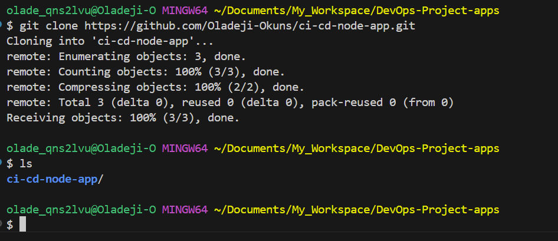

## **Project Title:** Introduction to GitHub Actions and CI/CD


## Objective:

To provide the theoretical knowledge gained on the CI/CD with GitHub Actions Course, and present the hands-on practical implementation for setting up Continuous Integration and Continuous Deployment (CI/CD) using GitHub Actions with a simple Node.js application that serves a static web page.

---

## Prerequisites:

### Tools and Accounts:

1. **Git & GitHub:** Installed and configured.
2. **GitHub Account:** Needed to host your repo and run workflows.
3. **Node.js & npm:** Installed for building your web server.
4. **Text Editor/IDE:** Recommended: VS Code
5. **Command Line:** Terminal access (Mac/Linux) or Git Bash (Windows)
6. **Internet Connection:** For cloning, pushing, and accessing cloud services.

### Knowledge Requirements:

* Basic Git & GitHub usage
* JavaScript fundamentals
* Node.js and npm usage
* CI/CD concepts (basic awareness)

<br>
<br>

---


## Introduction: Understanding CI/CD

**CI/CD** means Continuous Integration and Continuous Deployment. <br>

* **CI (Continuous Integration):** simply means merging code to shared repo multiple times a day. <br>
It is a DevOps practice where developers frequently merge their code changes into a shared repository, usually multiple times a day. <br> Each integration is automatically verified by running automated builds and tests, allowing teams to detect problems early.

    **Key goals of CI:**
    - Catch bugs early
    - Improve software quality
    - Reduce integration issues

    **Example:**
    Whenever a developer pushes code to GitHub, a CI system like GitHub Actions or Jenkins automatically runs:

    - Code compilation
    - Unit tests
    - Linting or formatting checks

<br>

* **CD (Continuous Deployment):** means automatically deploying code to production. It is the next step after Continuous Integration.

    With Continuous Deployment, every change that passes all stages of the CI pipeline is automatically deployed to production—without manual approval.

    **NOTE:** (Do not confuse Cntinuous Deployment with Continuous Delivery, which still requires manual approval before deployment.)

    **Key goals of CD:**
    - Deliver new features faster
    - Automate the entire release process
    - Improve reliability and deployment confidence

    **Example:**
    Once a code change passes all tests in CI, it is automatically:
    - Built into a Docker image
    - Deployed to a cloud server (like AWS EC2, Heroku, or Kubernetes)
    - Made live to users


**CI/CD** is like running a smooth kitchen: every code change is a new order, and GitHub Actions is your automated chef, prepping, testing, and serving it to your users with consistency.

**Why CI/CD Matters (Benefits):**

* Consistency in software builds
* Fewer bugs in production
* Faster deployment cycles
* Fast feedback
* Better code quality
* Easier and enhanced team collaboration

---

### CI/CD Pipeline Stages:

Below are the stages in CI/CD pipelines.

1. Code versioning (Git)
2. Integration (GitHub push triggers build/test)
3. Testing (automated)
4. Deployment (manual or automatic)

---

## Undestanding GitHub Actions

**GitHub Actions** is a powerful CI/CD tool built into GitHub.
It allows you to automate workflows (like testing, building, and deploying) directly from your GitHub repository.

**How GitHub Action works:**

With GitHub Acions, you define workflows using a `.yml` file in `.github/workflows/`

**Triggers can be:**
- Push to a branch
- Pull request
- Schedule (e.g., every night)
- Manual dispatch

**Example:**

```yaml
name: CI Pipeline

on: [push]

jobs:
  build:
    runs-on: ubuntu-latest
    steps:
      - uses: actions/checkout@v3
      - name: Install Dependencies
        run: npm install
      - name: Run Tests
        run: npm test
```

**Key benefits:**
- Fully integrated with GitHub
- Easy to set up
- Great for open source and private projects

### Concepts/Terminologies (Building blocks of  GitHub Actions):

* **Workflow:** YAML config describing what should happen and when
* **Event:** Triggers (e.g., push, PR, schedule)
* **Job:** Group of steps, runs on one runner
* **Step:** Individual command or action
* **Action:** A reusable package for automation (e.g., `actions/checkout@v2`)
* **Runner:** A VM (Virtual Machine) or server that runs the workflow


---

## **Practical Project Setup/Implementation**

Now, we will begin the hands-on practical implementation.

### Project Objective: 
To set up a simple Node.js web application integrated with GitHub Actions for Continuous Integration (CI) and Continuous Deployment (CD).

### Prerequisites
Before we begin the implementation, we need to ensure that we have the following:

1. **Git:** We need to verify and (if need be) install the Version control system to track changes in our code.
    - **Installation:**
        - For Windows: Download Git for Windows
        - For macOS: Download Git for macOS
        - For Linux: Use your distribution's package manager, e.g., sudo apt install git for Ubuntu.

2. **Node.js and npm:** We need to also install JavaScript runtime and package manager.

    - **Installation:**
    Visit Node.js Official Website and download the LTS version suitable for your operating system. <br>
    The installation includes both Node.js and npm.

3. **GitHub Account:** We also need to have or create a GitHub account to host our repository and be able to utilize GitHub Actions.

4. **Code Editor:** To write and edit our code. Preferrably Visual Studio Code

5. **Terminal or Command Prompt:** This is necessary for us so that we can run commands.

<br>

### **Setting up the Project/Implementation:**
Now, let us begin our project.

### Step 1: Create and initialize a GitHub Repository

To implement this step 1, we will carry out the following steps below:

1. Create new repo on GitHub, and name it `ci-cd-node-app`
2. Clone repo locally:

   ```bash
   git clone https://github.com/your_username/your_repo.git
   ```

   

   


3. **Create `.gitignore` file:** <br>
    It is important to create a `.gitignore` file before pushing to github to ensure that files like the `node_modules` and other unnecessary files are excluded from the version control.

    ```bash
    cd ci-cd-node-app
    touch .gitignore
    vi .gitignore
    ```

    Below is the content to be pasted into the `.gitignore file:

    ```gitignore
    # Node.js dependencies
    node_modules/

    # Optional npm cache directory
    .npm/

    # Logs
    logs/
    *.log
    npm-debug.log*
    yarn-debug.log*
    yarn-error.log*

    # Runtime data
    pids/
    *.pid
    *.seed
    *.pid.lock

    # Environment variables
    .env
    .env.test
    .env.local

    # Directory for instrumented libs generated by coverage tools
    coverage/

    # Build outputs
    dist/
    build/

    # IDEs and editors
    .vscode/
    .idea/
    *.sublime-project
    *.sublime-workspace

    # System files
    .DS_Store
    Thumbs.db

    # GitHub Actions
    # No need to ignore .github/ — we want to track workflows

    # Optional: Ignore test coverage results if using Jest or other tools
    *.lcov
    ```

    **Push `.gitignore` file to github:**

    ```bash
    git add .gitignore
    git commit -m "Add .gitignore file"
    git push
    ```


<br>

### Step 2: Create Simple Node.js App

1. **Initialize a Node.js project:**

    We get this done by running the command below to **initializing npm**, and this will create a `package.json` file, as shown below:

   ```bash
   cd ci-cd-node-app # To enter into the project's repository
   npm init -y
   ```

   

   

   


   **Note:** This `package.json` file holds metadata about our project and its dependencies.

<br>

*Next,  we will create a simple server using `Express.js` to enable us serve a static webpage. We do this by installing `Express` and then create our `index.js` file, as given in the steps below.*

2. **Install Express:**

    Now, we will install **Express**, which is a minimal and flexible Node.js web application framework. To do this, we run the command below:

   ```bash
   npm install express
   ```

   

3. **Create the Application file:**

    - **Create the `index.js` file:**

        In our project's folder, we will first create the `index.js` file, and this will be the main file of our application.:

            touch index.js

        Next, we will paste the script below into the `index.js` file which we just created.

            vi index.js
            

        ```js
        const express = require('express');
        const app = express();
        const port = process.env.PORT || 3000;

        app.get('/', (req, res) => {
            res.send('Hello World!');
        });

        app.listen(port, () => {
            console.log(`App listening at http://localhost:${port}`);
        });
        ```

        

        **OR**, you can use a script that enables logging requests to help check if requests are reaching your server. This can be helpful in isolating issues, just in case.

        ```js
        const express = require('express');
        const app = express();
        const port = process.env.PORT || 3000;

        app.use((req, res, next) => {
        console.log(`Incoming request: ${req.method} ${req.url}`);
        next();
        });

        app.get('/', (req, res) => {
        res.send('Hello World!');
        });

        app.listen(port, () => {
        console.log(`App listening at http://localhost:${port}`);
        });
        ```

    - **Update the `package.json Scripts:**

        Now, we have to add a start script (right before our test directive/command) to our `package.json` file to easily run our application.

        ```bash
        "scripts": {
        "start": "node index.js"
        }
        ```

        


4. **Test or run the express server app locally:**


   ```bash
   node index.js
   ```

   OR, we can start the server by using the command:

        npm start

    We should be able to see the output below in our terminal:

    We should see: `App listening at http://localhost:3000`
 
    

    

    **Test in Browser:**

    - When we open our internet browser and navigate to http://localhost:3000
    - We should see: Hello World!

    


5. **Push to GitHub:**

   ```bash
   git add .
   git commit -m "Initial commit"
   git push origin main
   ```

    


### Step 3: Set Up GitHub Actions for CI/CD
**Add GitHub Actions Workflow:**

In this step, we will create a `.github/workflows` directory in our repository, and then add a workflow file into the directory (e.g,. `node.js.yml`).

1. **Create workflow directory and create `.github/workflows/node.js.yml` file**

    ```bash
    cd ci-cd-node-app
    mkdir .github/ .github/workflows/
    touch .github/workflows/node.js.yml
    ```

    


2. **Add the following script or configuration below into the file:** <br>
Use vim editor to open the `node.js.yml` file and Paste below configuration script into it:

    ```yaml
    # Example: .github/workflows/node.js.yml

    # Name of the workflow
    name: Node.js CI

    # Specifies when the workflow should be triggered
    on:
    # Triggers the workflow on 'push' events to the 'main' branch
    push:
        branches: [ main ]
    # Also triggers the workflow on 'pull_request' events targeting the 'main' branch
    pull_request:
        branches: [ main ]

    # Defines the jobs that the workflow will execute
    jobs:
    # Job identifier, can be any name (here it's 'build')
    build:
        # Specifies the type of virtual host environment (runner) to use
        runs-on: ubuntu-latest

        # Strategy for running the jobs - this section is useful for testing across multiple environments
        strategy:
        # A matrix build strategy to test against multiple versions of Node.js
        matrix:
            node-version: [14.x, 16.x]

        # Steps represent a sequence of tasks that will be executed as part of the job
        steps:
        - # Checks-out your repository under $GITHUB_WORKSPACE, so the job can access it
        uses: actions/checkout@v2

        - # Sets up the specified version of Node.js
        name: Use Node.js ${{" matrix.node-version "}}
        uses: actions/setup-node@v1
        with:
            node-version: ${{" matrix.node-version "}}

        - # Installs node modules as specified in the project's package-lock.json
        run: npm ci

        - # This command will only run if a build script is defined in the package.json
        run: npm run build --if-present

        - # Runs tests as defined in the project's package.json
        run: npm test
    ```

    **Note:** Simply put, the script without comments above, is given below:

    <br>

    ```yaml
    name: Node.js CI

    on:
    push:
        branches: [ main ]
    pull_request:
        branches: [ main ]

    jobs:
    build:
        runs-on: ubuntu-latest
        strategy:
        matrix:
            node-version: [18.x]

        steps:
        - uses: actions/checkout@v2

        - name: Use Node.js ${{ matrix.node-version }}
            uses: actions/setup-node@v1
            with:
            node-version: ${{ matrix.node-version }}

        - run: npm ci
        - run: npm run build --if-present
        - run: npm test
    ```

    


    ---

    **Explanation of the script:**

    1. **`name`:** This simply names your workflow. It's what appears on GitHub when the workflow is running.

    2. **`on`:** This section defines when the workflow is triggered. Here, it's set to activate on push and pull request events to the main
    branch.

    3. **`jobs`**: Jobs are a set of steps that execute on the same runner. In this example, there's one job named `build`".

    4. **`runs-on`**: Defines the type of machine or operating system to run the job on. Here, it's using the latest Ubuntu virtual machine.

    5. **`strategy.matrix`**: This allows you to run the job on multiple versions of Node.js, ensuring compatibility.

    6. **`steps`**: A sequence of tasks executed as part of the job.

        - **`actions/checkout@v2`**: Checks out your repository under $GITHUB_WORKSPACE".
        - **`actions/setup-node@v1`**: Sets up the Node.js environment.
        - **`npm ci`**: Installs dependencies defined in package-lock. json.
        **`npm run build -- if-present`**: Runs the build script from  package. json if it's present.
        - **`npm test`**: Runs tests specified in  package. json.

3. **Commit and Push Workflow:**

    - **Add the workflow file:**

        ```bash
        git add .github/workflows/node.js.yml
        ```

    - **Commit the changes:**

        ```bash
        git commit -m "Add GitHub Actions workflow"
        ```

    - **Push to GitHub:**

        ```bash
        git push
        ```

        

### Step 4: Testing and Deployment

**Add automated Tests**

**1. Install Testing Framework:**

You can add unit tests using libraries like Jest or Mocha. <br>
For example, install Jest locally:

```bash
npm install --save-dev jest
```


**2. Create a Test file:**

Here, we can Create a test folder and add a file named `app.test.js`:

```bash
mkdir test
touch test/app.test.js
vi app.test.js
```

Paste below configuration into the file:

```javascript
test('Sample test', () => {
  expect(1 + 1).toBe(2);
});
```


**3. Update `package.json` with test script:**

We need to make it clear that we are using Jest by defining the test environment: 

Add the test script:

```json
"scripts": {
  "start": "node index.js",
  "test": "jest"
},
"jest": {
  "testEnvironment": "node"
}
```

**Note:** After installing Jest, your package.json will also have:

```json
"devDependencies": {
  "jest": "^29.0.0"
}
```

Our updated package.json file now contains below:

```json
{
  "name": "ci-cd-node-app",
  "version": "1.0.0",
  "description": "A simple Node.js application to practise ci/cd implementation using GitHub Actions.",
  "main": "index.js",
  "scripts": {
    "start": "node index.js",
    "test": "jest"
  },
  "jest": {
  "testEnvironment": "node"
},
  "repository": {
    "type": "git",
    "url": "git+https://github.com/Oladeji-Okuns/ci-cd-node-app.git"
  },
  "keywords": [],
  "author": "",
  "license": "ISC",
  "bugs": {
    "url": "https://github.com/Oladeji-Okuns/ci-cd-node-app/issues"
  },
  "homepage": "https://github.com/Oladeji-Okuns/ci-cd-node-app#readme",
  "dependencies": {
    "express": "^5.1.0"
  },
  "devDependencies": {
    "jest": "^30.0.2"
  }
}
```


**4. Run the test locally:**

Now that Jest is installed, we will run:

```bash
npm test
```

We should see an output like this below:

```bash
PASS  test/app.test.js
✓ Sample test (x ms)

Test Suites: 1 passed, 1 total
Tests:       1 passed, 1 total
```


**5. Remove the `node_modules` from GitHub repo and push:**
It is not recommended to push node_modules to github.

```bash
git rm -r --cached node_modules
git commit -m "Remove node_modules, update .gitignore, package.json and add test"
git push origin main
```


**Deployment Options (for future expansion):**

For deployment, we have options to perform the following:
* Deploy to **Heroku**, **Render**, **AWS EC2**, or **Vercel** via GitHub Actions
* Use secrets for authentication and configuration

In this case of the project, we will be implementing deployment to AWS EC2. The steps are given below:

**1. Deploy to EC2:**<br>
In order for us to deploy to EC2, we have to first create an EC2 instance on AWS, set up the instance, install docker and docker compose, create a deployment directory for us to be able to clone our repo and run docker, create our deployment script (deploy.sh script), create our GitHub Actions development workflow, and set up our GitHub secrets (which is recommended for security).
We deploy to EC2 by following the steps below:

1. ***Launch new EC2 instance:*** Go to your AWS Console → EC2 → Launch Instance.

    - Name the instance **`ci-cd-node-server`**.
    - Select AMI: Ubuntu Server 22.04 LTS (Free Tier eligible)
    - Pick your instance type, for example `t2.micro` or `t3.micro`.
    - Create key pair or use existing one if you have it (.pem file for SSH access).
    - Configure the Security group:
        - Allow SSH (22) from your IP
        - Allow HTTP (80) and Custom TCP 3000 from anywhere (0.0.0.0/0)

        

        

2. ***Connect and Setup EC2:***

    - **SSH into the instance:**
    First ssh into the instance by running the command below:

        ```bash
        cd path/to/your-pem-file
        chmod 400 your-key.pem
        ssh -i your-key.pem ubuntu@your-ec2-public-ip
        ```

    - **Install Dependencies (Node.js, Git, Docker):** After launching the Ec2 instance and sshing into the instance, we need to install docker, especially if we intend to make use of dockers. We do this by running the following commands below:

        ```bash
        # Update packages first
        sudo apt update && sudo apt upgrade -y

        # Then Install Node.js, Git and Docker
        sudo apt install -y nodejs npm git
        sudo apt install docker.io -y
        sudo systemctl start docker
        sudo systemctl enable docker
        node -v && npm -v && docker -v

        # Add user to docker group
        sudo usermod -aG docker ubuntu
        ```

        

        
        
        


    - **Effect Group change:** Now, we need to log out and log in again to apply the group change that we made (when we added user to the docker group).


    - **Install Docker Compose:** Next, we have to install docker compose, and we do this by running the commands below:

        ```bash
        sudo curl -L "https://github.com/docker/compose/releases/download/v2.24.4/docker-compose-$(uname -s)-$(uname -m)" -o /usr/local/bin/docker-compose
        sudo chmod +x /usr/local/bin/docker-compose
        docker-compose --version
        ```

        


3. ***Create a deployment Directory:***
    In this stage, we will have to create a deployment directory on our EC2 instance, and this directory will be the location where we will clone our repository and run Docker. We do this by running the following command below:

    ```bash
    mkdir -p ~/ci-cd-node-app && cd ~/ci-cd-node-app
    ```
    
    


4. ***Create a `Deploy.sh` script:***<br>

    Now, we will create our deployment script `deploy.sh` in our GitHub repository root (this will first be done in our local repo before we then push it to GitHub). 
    We will get this done by running the following commands below:

    ```bash
    #!/bin/bash

    # Stop and remove old container
    docker stop ci-cd-node-app || true
    docker rm ci-cd-node-app || true

    # Pull latest code
    cd ~/ci-cd-node-app
    git pull origin main

    # Rebuild and restart container
    docker build -t ci-cd-node-app .
    docker run -d --name ci-cd-node-app -p 80:3000 ci-cd-node-app
    ```


    Alternatively, you can use a production ready script below which uses `docker-compose` for local EC2 deployment, for your `deploy.sh` as given below:

    ```bash
    #!/bin/bash

    # --------------------------------------------
    # Production Deploy Script (Docker Compose)
    # Author: Oladeji
    # --------------------------------------------

    set -e  # Exit on error

    APP_NAME="ci-cd-node-app"
    APP_DIR="/home/ubuntu/$APP_NAME"

    echo "🚀 Starting deployment using docker-compose..."

    # Navigate to app directory
    cd "$APP_DIR"

    echo "📦 Pulling latest code..."
    git reset --hard
    git pull origin main

    echo "🧹 Stopping and removing old containers..."
    docker-compose down || true

    echo "🔧 Building and starting containers..."
    docker-compose up -d --build

    echo "✅ Deployment complete! App is live on port 80."
    ```

    


5. ***Make the `deploy.sh` script executable and Setup SSH Access:*** <br>
Once the `deploy.sh` script has been created, we need to ensure that this script has chmod +x deploy.sh and SSH is configured, as shown below:

    **1. Setup SSH on GitHub:**
    We need to setup SSH on our GitHub so that GitHub Actions can access our EC2 via SSH. We get this done by doing the following:

    - ***SSH Key Generation:*** If we haven't already generated our SSH key, we have to do it, and this must be done on our PC or local machine not our GitHub and not on our server/EC2 instance.

        ```bash
        ssh-keygen -t ed25519 -C "ci-cd-ec2-deploy"
        ```

        Then, in the prompt, choose or define the file in which to save the keys, for example:

        `/c/Users/olade_qns2lvu/.ssh/id_ed25519` but if you already have other SSH keys in use, like `ed25519` key files, it is recommended that you create custom files by defining custom files like below:

        `/c/Users/olade_qns2lvu/.ssh/cicd-node-ec2-key`

        This commnad will help create:
        - cicd-node-ec2-key (private)
        - cicd-node-ec2-key.pub (public)

        And you can find them in `~/.ssh/`

    - ***Add the public key to EC2:*** Run the command below on your PC/local machine to see and copy the content of the public key.

        ```bash
        cat ~/.ssh/cicd-node-ec2-key.pub
        ```

        Then, on your EC2 instance, copy the content or output of the key and paste it into `~/.ssh/authorized_keys` and save it, by running the command below:

    ```bash
    ssh-copy-id -i ~/.ssh/cicd-node-ec2-key.pub -o IdentityFile=~/Downloads/ci-cd-key.pem ubuntu@44.211.177.29
    ```

    **NOTE:** Ensure to edit the `path to your ec2-key.pem` file with the correct path.

    If that gives you error, then follow the steps below:

    **On your EC2 machine:**

        ```bash
        ssh -i your-existing-key.pem ubuntu@your-ec2-ip
        sudo vi ~/.ssh/authorized_keys # Then paste in the content of the public key (cicd-node-ec2-key.pub)
        chmod 600 ~/.ssh/authorized_keys
        ```

        Exit your Ec2 instance, and then go back to your local PC and run the following commands:

        ```bash
        chmod 600 ~/.ssh/cicd-node-ec2-key # For the private key only
        ssh -i ~/.ssh/cicd-node-ec2-key ubuntu@44.211.177.29 # You should be logged in to the EC2 instance
        ```

        OR, you can do it this way, below:

        ```bash
        ssh -i your-existing-key.pem ubuntu@your-ec2-ip
        echo "<contents-of-ec2-key.pub>" >> ~/.ssh/authorized_keys
        chmod 600 ~/.ssh/authorized_keys
        ```

    - ***Add the Private Key to GitHub Secrets:***

        To do this, we go to our GitHub repo and do the following:

        - Click on `Settings`, then click on `Secrets and variables`, and the finally go to `Actions`.
        - Next, click "New repository secret" under the “Repository secrets” section, add the following 3 secrets, one at a time:

        ```bash
        | Secret Name           | Value                                         |
        | --------------------- | --------------------------------------------- |
        | `EC2_SSH_KEY`         | The **entire content** of `cicd-node-ec2-key` |
        | `EC2_PUBLIC_IP`       | Your EC2 instance's **public IP**             |
        | `EC2_USER`            | Usually `ubuntu` for Ubuntu EC2               |
        | `MY_GITHUB_USER       | This is your Github Account's Username        |
        | `DOCKERHUB_USERNAME`  | This is your DockerHub Account's Username     |
        | `DOCKERHUB_TOKEN`     | Password or Access Token for your DockerHub   |
        ```

        Note: Enter `EC2_SSH_KEY`as the name, and do `cat cicd-node-ec2-key` to obtain the key from your ec2 machine, and then copy and paste it into the secrets section/box in github. <br>
        Paste your EC2 instance's public IP address and EC2 User as well.


        

        

        

        

    <br>

    **2. Make the `deploy.sh` script executable using `chmod +x`:**

    Now, in our local machine, we will make the `deploy.sh` script executable before we push it to GitHub by running the following commands below:

    ```bash
    chmod +x deploy.sh
    git add deploy.sh
    git commit -m "Make deploy script executable"
    git push origin main
    ```

<br>


**2. Dockerize the Node.js app:**

    Here, as we prepare for deployment and the use of dockers, we can dockerize our Node.js app by creating a `Dockerfile` and placing it in the root directory of our project,as shown below:

    ```bash
    cd ci-cd-node-app
    touch Dockerfile
    vi Dockerfile
    ```

    Then paste below script into your `Dockerfile` and save it:

    ```Dockerfile
    # Use an official Node.js LTS image
    FROM node:18

    # Create app directory
    WORKDIR /usr/src/app

    # Copy package.json and install dependencies
    COPY package*.json ./
    RUN npm install

    # Copy source files
    COPY . .

    # Expose port
    EXPOSE 3000

    # Run the app
    CMD [ "npm", "start" ]
    ```

    <br>

    **Create `docker-compose.yml` file in the root directory:**
    
    ***For Development Environment:***

    ```yaml
    version: '3.8'

    services:
    app:
        container_name: ci-cd-node-app
        build: .
        ports:
        - "80:3000"
        restart: always
        environment:
        - NODE_ENV=production
        volumes:
        - .:/usr/src/app
    ```

    <br>


    ***For Production Environment:***

    ```yaml
    # docker-compose.yml
    version: '3.8'

    services:
    app:
        container_name: ci-cd-node-app
        build: .
        ports:
        - "80:3000"
        restart: always
    ```
    <br>

    **Create the `.dockerignore` file as well, and place it in the root directory:**

    ```bash
    touch .dockerignore
    vi .dockerignore
    ```

    Then paste the following into the file and save it:

    ```dockerignore
    node_modules
    npm-debug.log
    .env
    .git
    ```

<br>

**3. Create GitHub Actions Deployment Workflow:**

Now, we have to create a new workflow file for deployment. Remember we already created a workflow for Continuous Integration (CI) earlier, that is the `node.js.yml` file, but now that we are into the deployment stage, we also need to create the workflow file for Continuous Deployment (CD).

We will create a file named `deploy.yml` in the github workflows location and the path will be defined as `.github/workflows/deploy.yml`. USe the commands and scritp below to get this done:

```bash
### In the root directory ci-cd-node-app, Create the workflow file
touch .github/workflows/deploy.yml
vi .github/workflows/deploy.yml
```

**If not pushing to docker hub but building locally:**

Paste the script below into the `deploy.yml` file.

```yaml
# .github/workflows/deploy.yml
name: 🚀 Deploy to EC2 (Local Docker Build)

on:
  workflow_run:
    workflows: ["Node.js CI"]
    types:
      - completed

jobs:
  deploy:
    if: ${{ github.event.workflow_run.conclusion == 'success' }}
    runs-on: ubuntu-latest

    steps:
      - name: ⏬ Checkout repository
        uses: actions/checkout@v3

      - name: 🔐 Set up SSH
        uses: webfactory/ssh-agent@v0.5.4
        with:
          ssh-private-key: ${{ secrets.EC2_SSH_KEY }}

      - name: 🚀 Run deploy.sh on EC2
        env:
          MY_GITHUB_USER: ${{ secrets.MY_GITHUB_USER }}
        run: |
          ssh -o StrictHostKeyChecking=no ubuntu@${{ secrets.EC2_PUBLIC_IP }} << 'EOF'
            export APP_NAME="ci-cd-node-app"
            export APP_DIR="/home/ubuntu/$APP_NAME"

            if [ ! -d "$APP_DIR" ]; then
              echo "📦 Cloning repository..."
              git clone https://github.com/$MY_GITHUB_USER/$APP_NAME.git $APP_DIR
            fi

            cd $APP_DIR
            git pull origin main
            chmod +x deploy.sh
            ./deploy.sh
          EOF
```


**If pushing to dockerhub, then paste the script below into the `deploy.yml` file:**
```yaml
# .github/workflows/deploy.yml
name: 🚀 Deploy to EC2 via SSH (Production)

on:
  workflow_run:
    workflows: ["Node.js CI"]
    types:
      - completed

jobs:
  deploy:
    if: ${{ github.event.workflow_run.conclusion == 'success' }}
    runs-on: ubuntu-latest

    steps:
    - name: ⏬ Checkout code
      uses: actions/checkout@v3

    - name: 🔐 Setup SSH agent
      uses: webfactory/ssh-agent@v0.5.4
      with:
        ssh-private-key: ${{ secrets.EC2_SSH_KEY }}

    - name: 📡 Deploy to EC2 via SSH
      env:
        DOCKERHUB_USERNAME: ${{ secrets.DOCKERHUB_USERNAME }}
        DOCKERHUB_TOKEN: ${{ secrets.DOCKERHUB_TOKEN }}
      run: |
        ssh -o StrictHostKeyChecking=no ubuntu@${{ secrets.EC2_PUBLIC_IP }} << 'EOF'
          export DOCKERHUB_USERNAME="$DOCKERHUB_USERNAME"
          export DOCKERHUB_TOKEN="$DOCKERHUB_TOKEN"

          cd ~/ci-cd-node-app || git clone https://github.com/${{ github.repository }} ~/ci-cd-node-app && cd ~/ci-cd-node-app

          chmod +x deploy.sh
          ./deploy.sh
        EOF
```

**NOTE:** Don't forget to verify that you have defined the following values into the GITHUB Secrets:

`EC2_USER` <br>
`MY_GITHUB_USER` <br>
`EC2_SSH_KEY` <br>
`EC2_PUBLIC_IP` <br>
`DOCKERHUB_USERNAME` <br>
`DOCKERHUB_TOKEN`


<br>

**4. Commit and push to GitHub**

```bash
git status
git add .
git commit -m "Committing CI & CD workflows, docker files and updated deploy.sh"
git push origin main
```

### Experimenting Ideas:

**1.** **Triggering our CI/CD:**
    
- **Making changes:** To test or trigger our CI/CD, we can make a change by editing our `index.js` file or simply editin gour `README.md` file.

    Let's add the following edits to our `index.js` file by placing the code below at the top of our `index.js` file:

```js
console.log("// just a test");

```

Therefore, our updated `index.js` file will look like this below:

```js
console.log("// just a test");


const express = require('express');
const app = express();
const PORT = process.env.PORT || 3000;

// Middleware for logging requests
app.use((req, res, next) => {
  console.log(`[${new Date().toISOString()}] ${req.method} ${req.url}`);
  next();
});

// Test route
app.get('/api/test', (req, res) => {
  res.json({ message: 'Test route is working!' });
});

// Root route
app.get('/', (req, res) => {
  res.send('Hello from CI/CD Node.js App!');
});

// Error handling middleware
app.use((err, req, res, next) => {
  console.error('Unhandled Error:', err);
  res.status(500).json({ error: 'Something went wrong!' });
});

app.listen(PORT, () => {
  console.log(`✅ App listening at http://localhost:${PORT}`);
});
```

<br>

- **Commit and Push:**

Next, after applying the changes or edits, we commit and push to github to test our CI/CD is triggered.

```bash
git add index.js
git commit -m "Trigger CI/CD pipeline with test log"
git push origin main
```


- **Error detection and Resolution:**

    After pushing to github, it was observed that the CI process was successful but the CD process failed due to the error below:


**REASON IT FAILED:**
The error observed here is:

```bash
1 error
deploy
Command failed: ssh-add - Error loading key "(stdin)": error in libcrypto
```

This means our private key was pasted incorrectly into GitHub Secrets. It is probably missing line breaks or not in proper OpenSSH PEM format.


**SOLUTION:**
We have to fix this issue by adding our SSH Key to GitHub Secrets correctly.

- **Display the private key correctly:**
 We have to locate where we stored or saved our generated SSH key pairs on our local PC or computer and run this command in our terminal to see the contents of the key:

 ```bash
 cat ~/.ssh/cicd-node-ec2-key
```

Then we must copy the content of the key correctly and paste it in out github secrets.

**Trigger the pipeline again:** <br>
After corrections have been made, we can trigger the pipeline again by doing the following below:

```bash
echo "// test trigger $(date)" >> index.js
git add index.js
git commit -m "🚀 Trigger CI/CD pipeline with test log"
git push origin main
```

After testing, it gave an error below:

```
1 error
deploy
Process completed with exit code 127.
```

**Solution:**

- **Update deploy.yml, and deploy.sh files:**

```yaml
name: 🚀 Deploy to EC2 (Local Docker Compose)

on:
  workflow_run:
    workflows: ["Node.js CI"]      # CI workflow name must match this
    types:
      - completed

jobs:
  deploy:
    if: ${{ github.event.workflow_run.conclusion == 'success' }}
    runs-on: ubuntu-latest

    steps:
      - name: ⏬ Checkout repository
        uses: actions/checkout@v3

      - name: 🔐 Setup SSH Agent
        uses: webfactory/ssh-agent@v0.8.1
        with:
          ssh-private-key: ${{ secrets.EC2_SSH_KEY }}

      - name: 🚀 SSH into EC2 and deploy
        run: |
          ssh -o StrictHostKeyChecking=no ubuntu@${{ secrets.EC2_PUBLIC_IP }} << EOF
            set -e
            APP_NAME="ci-cd-node-app"
            APP_DIR="/home/ubuntu/\$APP_NAME"

            echo "📁 Checking for project directory..."
            if [ ! -d "\$APP_DIR" ]; then
              echo "📦 Cloning repository from GitHub for the first time..."
              git clone https://github.com/${{ secrets.MY_GITHUB_USER }}/\$APP_NAME.git \$APP_DIR
            fi

            cd \$APP_DIR

            echo "📥 Pulling latest changes..."
            git pull origin main

            echo "🔧 Making deploy.sh executable..."
            chmod +x deploy.sh

            echo "🚀 Running deploy.sh..."
            ./deploy.sh
          EOF
```

**NOTE:** We can re-test our CI/CD as below:

**Make changes and commit:**
Let's make a small commit to the main branch, as below:

```bash
echo "// triggering redeploy $(date)" >> index.js
git add index.js
git commit -m "Trigger CI/CD test"
git push origin main
```

**Check GitHub Actions:**
Then, we will go to GitHub, then to our repository, and then to `Actions` Tab to check.
We will see:

- Node.js CI run (unit tests, etc.)
- If our CI succeeds, Deploy to EC2 will be triggered automatically

**Check Browser:**

After ~30–60s, we can visit our EC2 IP in a browser:

http://44.211.177.29/


**Further Practise:** We can further choose to try to:
* Add multiple workflows
* Try failure/recovery scenarios
* Test in Docker environments

---

