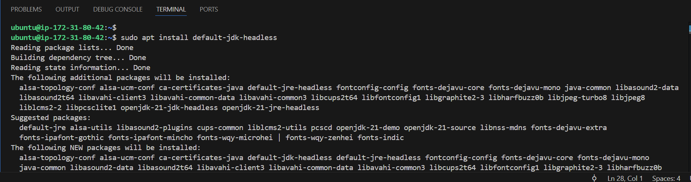

# Introduction to CICD

## Getting Started with Jenkins

### Create the EC2 instance

Create an EC2 instance and name it **Jenkins**.

### Update package repositories

SSH into the Jenkins instance and run the commands below:

`sudo apt update`

### Install JDK

Install the JDK using the command below:

`sudo apt install default-jdk-headless`

### Install Jenkins 

Now, install Jenkins on the EC2 instance created using the command below:

    wget -q -O - https://pkg.jenkins.io/debian-stable/jenkins.io.key | sudo apt-key add -
    sudo sh -c 'echo deb https://pkg.jenkins.io/debian-stable binary/ > \
    /etc/apt/sources.list.d/jenkins.list'
    sudo apt update
    sudo apt-get install jenkins

The commands above installs Jenkins. It involves importing the Jenkins GPG key for package verification, adding the Jenkins repository to the system's sources, updating package lists and finally, installing Jenkins throught the package manager (apt-get).

Upon runnning the commands above, it produced some errors which could be due to two reasons:
    
- *Missing **Public key:*** The key for the Jenkins repository is not available, which is causing a NO_PUBKEY error. This is because the apt repository requires a signed key to authenticate the packages being installed, and my system is not able to verify this key.

-  *Repository Signature Issue:* The repository isn't signed properly, so my system is rejecting it.

#### How to fix these issues:

**Step 1:** Add the Jenkins repository key manually.  
You can fix the "NO_PUBKEY" error by manually adding the Jenkins public key to your system. Run the following commands below:

    wget -q -O - https://pkg.jenkins.io/debian/jenkins.io.key | sudo tee /etc/apt/trusted.gpg.d/jenkins.asc

This command downloads the Jenkins GPG key and stores it in the trusted keyring folder. Now your system will trust packages coming from the Jenkins repository.

**Step 2:** Update package list.  
After adding the key, update your apt package list:

    sudo apt update

**Step 3a:** Install Jenkins.  
Now, you should be able to install Jenkins without the public key issue:

    NOTE: 
    The warning about apt-key being deprecated is because apt-key is being phased out in favor of managing keys in the /etc/apt/trusted.gpg.d/ directory directly. The command I used in Step 1 will store the key in the proper directory to avoid this deprecation warning.

If the issue still persists because the Jenkins public key is either missing or not properly configured. You can try a couple of steps to manually resolve this issue.

**Step 1:** Remove the previous key (if any) using the command below:

    sudo rm /etc/apt/trusted.gpg.d/jenkins.asc

**Step 2:** Manually add the key again

    wget -q -O - https://pkg.jenkins.io/debian/jenkins.io.key | sudo tee /etc/apt/trusted.gpg.d/jenkins.asc

Make sure there are no errors in this command. It should download the GPG key and save it in the correct directory.

**Step 3:** Update package lists

    sudo apt update

**Step 4:** Install Jenkins

    sudo apt-get install jenkins

 

If after trying all these above and the issue still persists, then you can do either of the following:

- **Check Internet Connectivity:** Ensure that your EC2 instance has proper internet connectivity, and no firewall rules are blocking access to https://pkg.jenkins.io.

- **Try Keyserver:** If the above steps still don't work, try adding the key from a keyserver:

        sudo apt-key adv --keyserver keyserver.ubuntu.com --recv-keys 5BA31D57EF5975CA

In this case here, all the previous steps did not work until I added the key from a keyserver, as shown below:

**Reinstalling Jenkins:** Now, we reinstall Jenkins.

    sudo apt-get install jenkins

### Check if Jenkins has been installed:

Next, we check if Jenkins has been installed, and is up and runnning, using the command below:

    sudo systemctl status jenkins

### Setting In-bound Rules on Jenkins instance:

On our Jenkins EC2 instance, we create new inbound rule for port 8080 in security group. Jenkins listens on port 8080 by default, that is why we have to make sure that we set or create an inbound rule for this in the security group of our Jenkins instance.

### Set up Jenkins on the Web Console:

To do this, we do the following:

i. Input the Jenkins instance ip address on the web browser, i.e `http://public_ip_address:8080`

ii. On our Jenkins instance, we will check `/var/lib/jenkins/secrets/initialAdminPassword` to know our password.

Insert the password and click continue.

iii. Install suggested plugins:

iv. Create a User account:

v. Log into Jenkins console:

Finally, we have been able to install Jenkins on our EC2 instance and created a user.

