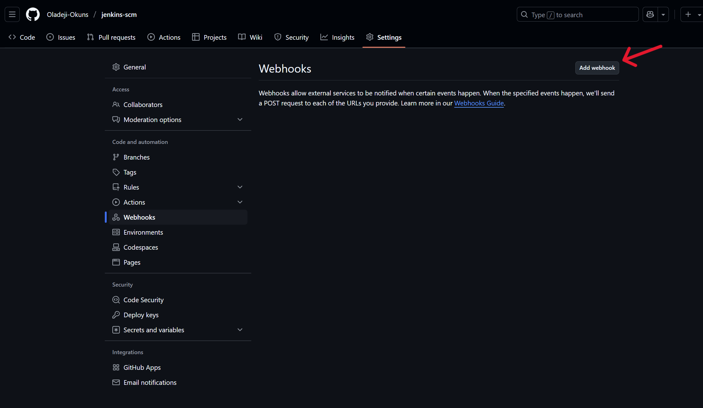

# JENKINS FREESTYLE PROJECT

## Introduction

Jenkins is an open-source automation server that helps automate parts of the software development process, such as building, testing, and deploying code. One of its core functionalities is the ability to create and manage different types of jobs, with the **Freestyle Project** being the most basic and flexible type.

## Objectives

- Understand what a Jenkins Freestyle Project is.
- Understand what a Jenkins Job is.
- Learn how to create and configure a Freestyle Project.
- Explore how to connect Jenkins to Source Code Management.
- Learn how to configure build triggers.

## Jenkins Freestyle Project

A **Jenkins Freestyle Project** is the most basic and flexible type of job that you can create in Jenkins. It allows you to define simple build processes through a graphical user interface without needing to write code. <br>
The **Jenkins Freestyle Project** allows users to define simple build jobs with a sequence of steps, such as pulling code from version control, compiling it, running tests, and deploying artifacts. It provides an intuitive UI for configuration and supports plugins for extended functionality.

Typical uses of a Jenkins Freestyle project:
- Building and testing small to medium projects.
- Running scripts or commands periodically or on commit.
- Automating deployment steps.
- Sending notifications after a build completes.

## Jenkins Job

A Jenkins job is a unit work or task that can be executed by the automation server. It represents a specific task or set of tasks that need to be performed as part of a build or deployment process (typically related to building, testing or deploying software).

## Creating a Freestyle Job

Now, we will create our first build job using the following steps below.

**i. Create New Item:** <br>
Enter the URL for Jenkins, log in to Jenkins and then once you can see the dashboard, navigate to the left side of the dashboard menu and click on `+ New Item`.


**ii. Create a freestyle project and name it "`my-first-job`".


## Connecting Jenkins to our Source Code Management

After creating our freestyle project, the next thing we will do is to connect our Jenkins with github.
To get this done, we will do the following steps, below.

**i.** Create a new github repository called jenkins-scm with a README.md file.


**ii.** Connect **`jenkins`** to **`jenkins-scm`** repository by first navigating to the `Source Code Management` section on the Jenkins configuration page, select `Git` and then copy the `jenkins-scm` repository url from github and paste it into the "Repository URL" section on the Jenkins `Configure` page.


**NOTE:** You have to make sure your current branch on github is **`main`**.


**iii.** Save the configuration and then, run "build now" to connect jenkins to our repository.


With this, we have successfully connected jenkins with our github repository (jenkins-scm).

## Configuring Build Triggers

As a devops engineer, one of the very important skills and knowledge to have is the ability to automate things and processes inorder to make our work easier. <br>
Previously, we successfully connected our `jenkins` to our `jenkins-scm`, but at the moment we still need to manually click on the `Build Now` button before any new build action can take place. This kind of process defeats the purpose of automation.<br>
Therefore, we need to eliminate the manual process and introduce some form of automation where new builds can be initiated automatically as soon as there is an update to the `jenkins-scm` repository. <br> <br> 
In order to do this, we need to configure a **`Build Trigger`** to our jenkins job, and with this, jenkins will be able to run a new build anytime a change is made to our github repository. We follow the steps below:

**i.** Click "`Configure`" on your job and scroll down to the **`Triggers` section, in order to be able configure "build triggers".


**ii.** Click on "Triggers" to configure triggering the job from Guthub Webhook, by selecting the option named **`GitHub hook trigger for GITScm polling`**.


**iii.** Create a github webhook using jenkins ip address and port.

To do this, do the following:

- Go to your created GitHub repository.
- Click on Settings > Webhooks > Add webhook.
- Fill the form by entering the following:

    - On the Webhook page, input the Jenkins server URL followed by **`github-webhook/`** in the **payload URL** section, and 
    - choose **`application/json`** for the **content-type**. <br><br>





**iv.** **Test the webhook**

- **Create Local Project Folder & README**
    - Locally create a project folder called `jenkins-scm`.
    - Write some meaningful content into the local `README.md`.

        Use the following commands:

            mkdir jenkins-scm
            cd jenkins-scm
            echo "# Jenkins SCM Integration

            This project contains information and examples on Jenkins integration with Source Code Management (SCM) systems." > README.md


        

- **Initialize Git Locally for the new folder (if not already initialized)** <br>
Because the `jenkins-scm` folder was newly created and separate from our existing git initialized folder, we will have to also initialize this folder to make it easy for us to connect and push changes to github.
To get this done, we do the following while in the `jenkins-scm` folder:

        git init
        git add README.md
        git commit -m "Add detailed README for Jenkins SCM project"

    

   
- **Connect to GitHub Repo (which already exists)**

    Now, we will have to connect to our Github repository (jenkins-scm) which already exists in our Github, using the following command below:

        git remote add origin git@github.com:Oladeji-Okuns/jenkins-scm.git

    


- **Pull Remote Changes First (to handle the empty README already on GitHub)**

    - **Run the command below to pull remote changes first:**

            git pull origin main --allow-unrelated-histories


        This step is needed because GitHub already has a commit (the empty README), and my local machine has a commit too. The `--allow-unrelated-histories` flag makes it possible to combine both of them.

        


    - **Resolving merge conflcit issues**

        The initial plan was to replace the empty README.md which we have on the `jenkins-scm` Github repository, but an error arose during the pull process, which shows that the remote `jenkins-scm` repository is not empty, hence resulting in a merge conflict when we tried to push to Github. <br>
    To resolve this, we do the following:

        - **Open the conflicting file (README.md) using the vi-editor**. <br>
        Inside, you'll see conflict markers like these:

                <<<<<<< HEAD
                Your local content
                =======
                Remote content from origin/main
                >>>>>>> origin/main


            In our case, this is what we have:

                <<<<<<< HEAD
                # Jenkins SCM Integration

                This project contains information and examples on Jenkins integration with Source Code Management (SCM) systems.
                =======
                # jenkins-scm
                >>>>>>> 324bb2b0e469add87e00bb113272d08f94487236


            Then, we decide how we want the final content to look — either keep our local changes, the remote changes, or have a combination.We remove the conflict markers (<<<<<<<, =======, >>>>>>>) and clean up the content.

        - **Mark the file as resolved**

            After we have finished editing and saving the README.md file which we opened using the vi-editor, we can then mark the file as resolved by running the following command.

                git add README.md
 

            


- **Commit the merge**

    Next, we commit the merge with a commit message that shows that the merge conflict was resolved.

        git commit -m "Resolved merge conflict in README.md"


    


- **Push the changes (Local README) to GitHub** <br>
    - After the `commit`, we can then `Push` only the content we have written in the README.md file to Github, using the following command:

            git push origin main

    ```
    NOTE: You use `git push -u origin main` in cases where it is the first time you are pushing to the `main` branch or if you want to set up a tracking relationship between your local main and origin/main.
    In our case here, we already have a tracking relationship between our local main and origin/main, so no need to use the flag `-u` in our command.
    ```

    


## Testing the outcome of the build triggers configuration

After pushing to Github, go to the Jenkins dashboard, and then navigate to your created job `my-first-job`, and check to see if a build was triggered automatically after the push action to Github.


In the screenshot above, you can see that a build was automatically triggered after the README.md changes was pushed to Github.

END OF JENKINS FREESTYLE PROJECT


