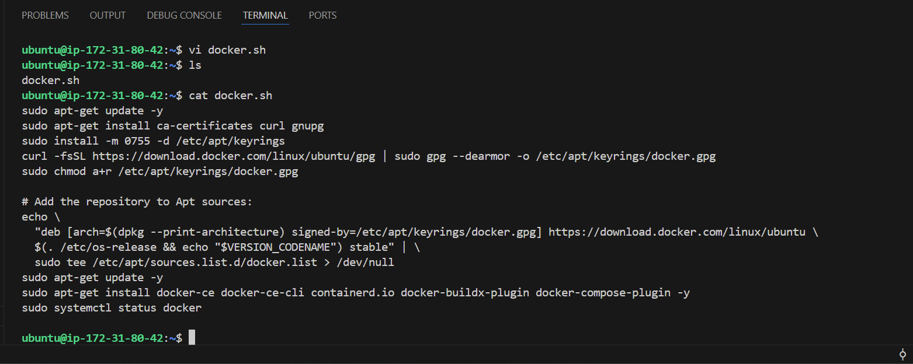
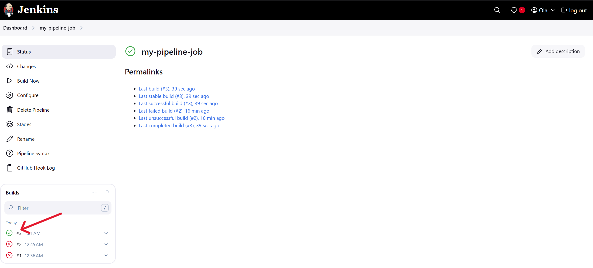

# JENKINS PIPELINE JOB

## Introduction

Jenkins is a widely-used open-source automation server that enables developers to build, test, and deploy applications efficiently. Among the various job types it supports, the **Pipeline Job** is one of the most powerful and flexible. A Jenkins Pipeline Job allows users to implement complex workflows and Continuous Integration/Continuous Delivery (CI/CD) processes as code, using a domain-specific language (DSL) based on Groovy.

## Objectives

The objectives of this project include the following below:

- Understand what a Jenkins Pipeline Job is and why it is used.
- Learn the differences between Declarative and Scripted Pipelines.
- Explore the structure and components of a Jenkinsfile.
- Learn how to create pipeline jobs.
- Learn how to write a Jenkins pipeline script.
- Learn how to install Docker
- Gain knowledge on how to build a pipeline script.


## **What is a Jenkins Pipeline Job?**

A Jenkins Pipeline Job is a type of Jenkins project that defines the entire build lifecycle as code. The job executes according to the logic described in a Jenkinsfile, which can be version-controlled along with the application code.

Jenkins pipelines are essential for automating the build, test, and deployment processes in software development.

**Key Features:**
- Code as configuration (Jenkinsfile)
- Stage-wise execution with visibility into each phase
- Supports complex logic, including loops, conditions, and parallelism
- Durable execution, surviving Jenkins restarts.


## **Creating a Pipeline Job**

Now, let's create our first pipeline job, using the following steps below:

i. Log into your Jenkins server and from the dashboard menu on the left side, click on `new item`.


ii. Create a pipeline job and name it `my-pipeline-job`


## **Configuring Build Trigger**

Here, we will create a build trigger for jenkins to trigger new builds. To do this, we do the following:

i. Click `Configure` on your job and add these configurations.

ii. Click on `Trigger` to configure triggering the job from GitHub webhook, and click `Save`.


iii. The next part here requires creating a webhook on GitHub for the pipeline job, but since we already created a webhook in our previous project titled the "Jenkins Freestyle Project", we do not need to create another one.


## **Writing Jenkins Pipeline Script:**

### **What is a Jenkins Pipeline Script?**

A **Jenkins pipeline script** refers to a script that defines and ochestrates the steps and stages of a continuous integration and continuous delivery (CI/CD) pipeline. <br>
A **Jenkins Pipeline script** is a way to define the steps of a Jenkins build process in code. Instead of clicking around the Jenkins UI to create a job, you write a script, usually in Groovy-based Domain Specific Language (DSL), that Jenkins understands and executes.

### Types of Jenkins Pipeline Scripts

Jenkins pipelines can be defined using either **declarative** or **scripted** syntax. Therefore, there are two main types of Jenkins Pipeline Scripts, namely:

1. Declarative Pipeline
2. Scripted Pipeline


### **1. Declarative Pipeline**

A Declarative Pipeline is a more structured, concise and simplified syntax for defining Jenkins pipelines. It simplifies the creation of pipelines by using a predefined structure, making it easier to read, maintain, and troubleshoot. It uses a domain-specific language to describe the pipeline stages, steps and other configurations.

**Characteristics of Declarative Pipeline:**
- It uses a pipeline {} block.
- Enforces a specific structure.
- Designed for simplicity and readability.
- Ideal for most CI/CD workflows.

**Example:**
```
pipeline {
    agent any
    stages {
        stage('Build') {
            steps {
                echo 'Building...'
            }
        }
        stage('Test') {
            steps {
                echo 'Testing...'
            }
        }
        stage('Deploy') {
            steps {
                echo 'Deploying...'
            }
        }
    }
}

```

### 2. **Scripted Pipeline**

A Scripted Pipeline uses a more flexible, Groovy-based syntax. It gives you full control and customization power over the pipeline, making it suitable for complex logic or conditional execution. It is suitable for complex scripting requirements.

**Characteristics of Scripted Pipeline:**
- It uses a node {} block.
- Offers full control using Groovy programming constructs (e.g., loops, conditionals).
- Requires more coding experience.
- Ideal for advanced use cases or custom logic.

**Example:**

```
node {
    stage('Build') {
        echo 'Building...'
    }
    stage('Test') {
        echo 'Testing...'
    }
    stage('Deploy') {
        echo 'Deploying...'
    }

}

```

### Writing our Pipeline Script
Now, we will focus on writing our Pipeline script. <br>

Below is a script.

```
pipeline {
    agent any

    stages {
        stage('Connect To Github') {
            steps {
                checkout scmGit(
                    branches: [[name: '*/main']],
                    extensions: [],
                    userRemoteConfigs: [[url: 'https://github.com/Oladeji-Okuns/jenkins-scm.git']]
                )
            }
        }

        stage('Build Docker Image') {
            steps {
                script {
                    sh 'docker build -t dockerfile .'
                }
            }
        }

        stage('Run Docker Container') {
            steps {
                script {
                    sh 'docker run -itd -p 8081:80 dockerfile'
                }
            }
        }
    }
}


```

**Explanation of the script above**
The Jenkins pipeline script provided above defines a series of stage for a continuous integration and continuous delivery (CI/CD)
 process. <br>
Below is a break down of each stage.

**Agent Configuration:**

```
agent any
```

This specifies that the pipeline can run on any available agent (an agent can either be a Jenkins master or node). This means the pipeline is not tied to a specific node type.


**Stages:**

```
stages {"\n      // Stages go here\n   "}
```

This defines the various stages of the pipeline, each representing a phase in the software delivery process.

**Stage 1: Connect to Github:**

```
stage('Connect To Github') {"\n      steps {\n         checkout scmGit(branches: [[name: '*/main']], extensions: [], userRemoteConfigs: [[url: 'https://github.com/Oladeji-Okuns/jenkins-scm.git']])\n      "}
}
```
- This stage checks out the source code from a GitHub repository (https://github.com/Oladeji-Okuns/jenkins-scm.git). <br>
- It also specifies that the pipeline should use the 'main' branch.

**Stage 2: Build Docker Image**

```
stage('Build Docker Image') {"\n      steps {\n         script {\n            sh 'docker build -t dockerfile .'\n         "}
   }
}
```

- This stage builds a Docker image named 'dockerfile' using the source code obtained from the GitHub repository. <br>
- The **`docker build`** command is executed using the shell (**`sh`**)

**Stage 3: Run Docker Container:**

```
stage('Run Docker Container') {"\n      steps {\n         script {\n            sh 'docker run -itd --name nginx -p 8081:80 dockerfile'\n         "}
   }
}
```
- This stage runs a Docker container named `nginx` in detached mode (`-itd`).
- The container is mapped to port 8081 on the host machine (`-p 8081:80`).
- The Docker image used is the one built in the previous stage ('dockerfile').
<br>
<br>

**Copy the pipeline script and paste it in the pipeline section as shown below:**


<br>

The stage 1 of the script connects jenkins to GitHub repository. To generate syntax for our github repository, we follow the steps below:

**i. Click on the pipeline syntax in the pipeline section.**


<br>

**ii. Select the dropdown to search for `checkout: Check out from version control`.**


<br>

**iii. Paste our repository's URL and make sure our branch is on `main`.**


<br>

**iv. Next, we generate our pipeline script.**


Now, we can replace the generated script with the one defined in the script section for connecting jenkins with github, and then click save.

## **Installing Docker**

It is important to know that before jenkins can run docker commands, we need to install docker on the same EC2 instance which jenkins was installed. We will install docker with shell script using our shell scripting knowledge as shown in the steps below.

**i. Create a file named `docker.sh`.**

**ii. Open the file and paste the script below into it:**

```
sudo apt-get update -y
sudo apt-get install ca-certificates curl gnupg
sudo install -m 0755 -d /etc/apt/keyrings
curl -fsSL https://download.docker.com/linux/ubuntu/gpg | sudo gpg --dearmor -o /etc/apt/keyrings/docker.gpg
sudo chmod a+r /etc/apt/keyrings/docker.gpg

# Add the repository to Apt sources:
echo \
  "deb [arch=$(dpkg --print-architecture) signed-by=/etc/apt/keyrings/docker.gpg] https://download.docker.com/linux/ubuntu \
  $(. /etc/os-release && echo "$VERSION_CODENAME") stable" | \
  sudo tee /etc/apt/sources.list.d/docker.list > /dev/null
sudo apt-get update -y
sudo apt-get install docker-ce docker-ce-cli containerd.io docker-buildx-plugin docker-compose-plugin -y
sudo systemctl status docker

```




**iii. Save and close the file.**

**iv. Make the file executable using thew command below.**

    chmod u+x docker.sh


**v. Execute the file using the command below.**

    ./docker.sh


With this, we have successfully installed docker.

### Setting permissions to allow Jenkins to run Docker

Next, we have to add the Jenkins user to the Docker group to allow Jenkins be able to run Docker, using the command below:

    sudo usermod -aG docker jenkins

**Restart Jenkins:**

Then, we restart Jenkins so that it picks up the Docker permissions.


## Building Pipeline Script

After we install docker on the same instance as our Jenkins, we need to create a "dockerfile" before we can run our pipeline script. <br>
It is important to note that we cannot build a docker image without a dockerfile.

To implement this stage, let's go into the main branch of our `jenkins-scm` repository, and do the following:

**i. Create a file named `dockerfile`.**


**ii. Paste the code snippet below into the file.**

```
# Use the official NGINX base image
FROM nginx:latest

# Set the working directory in the container
WORKDIR  /usr/share/nginx/html/

# Copy the local HTML file to the NGINX default public directory
COPY index.html /usr/share/nginx/html/

# Expose port 80 to allow external access
EXPOSE 80

```


**iii. Create an `index.html` file and paste the content below into it.**

    Congratulations, You have successfully run your first pipeline code.


**iv. Push the files to github.**

After pushing the files to github, there was a successful build.



**NOTE:** It is very important to set docker permissions for jenkins if we want jenkins to be able to run docker. Initially, the builds failed because permissions were not set and also the pipeline script needed to be corrected, but after the permission were set and script optimized, the build error was resolved and successfully built.


## Accessing the content on the `index.html` file

To access the content of the `index.html` file on our web browser, we need to set or add new inbound rule on our jenkins instance, and open the port we mapped our container to, which is port `8081`, as shown below:


Then, once this is done, we can now go to our browser to view the content of the `index.html` file by entering the url `http://174.129.74.74:8081` into the web browser.


<br>
<br>
<br>

**JENKINS PIPELINE JOB MINI-PROJECT SUCCESSFULLY COMPLETED**


